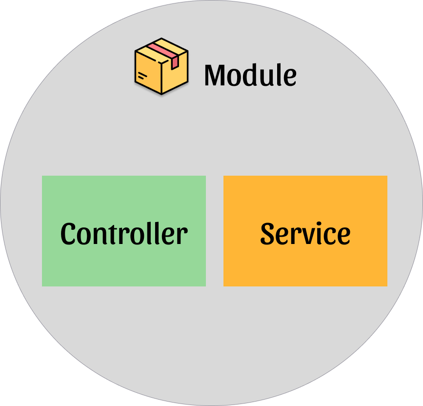

# [2장] 웹 개발 기초 지식

# 2.1 웹 프레임워크

- 프레임워크는 ‘뼈대’, ‘골조’라는 뜻으로 미리 만들어둔 뼈대를 세우고 살을 붙여가는 작업을 한다.
- 정해진 방법과 추상화된 인터페이스를 제공한다.
- 자유도가 제약되는 반면, 쉽고 빠르게 안정적인 애플리케이션을 구축할 수 있다.

### 프레임워크 선택 시 고려사항

`개발문서` , `사용자 수` , `활성 커뮤니티` , `깃허브 스타 수와 이슈 대응`

# 2.2 Node.js

> **JavaScript everywhere 🎉**

- Nest로 작성한 소스 코드를 Express나 Fastify에서 실행 가능한 자바스크립트 소스 코드로 컴파일하는 역할을 한다.

## Node.js의 역사


- 1995년 이전에는 HTML과 CSS만으로 웹 사이트를 만드는 시절이 있었다.
- 1995년 JavaScript가 도입되면서 여러 브라우저들이 JavaScript Engine을 탑제하기 시작한다.
- 2008년 크롬에서 JIT(Just-in-time compilation)를 지원하는 V8엔진을 만들었다.
- 2009년 `Ryan Dahl`이 Node.js를 개발하면서 세상에 나타나기 시작했다.

### Node.js의 특징

1. JavaScript Rungime
2. Single Thread
3. Non-Blocking I/O
4. Event-Driven

<aside>
💡

메인 스터디는 NextJS이므로, Node.js에 대해서는 따로 스터디를 만들어서 공부할 예정.

</aside>

## 2.6 데커레이터

- 데커레이터(decorator)를 잘 사용하면 횡단 관심사(cross-cutting concern)를 분리하여 관점 지향 프로그래밍을 적용한 코드를 작성할 수 있다.
- 클래스, 메서드, 접근자, 프로퍼티, 매개변수에 적용 가능하다.
- 각 요소의 선언부 앞에 `@`로 시작하는 데커레이터를 선언하면 데커레이터로 구현된 코드를 함께 실행한다.

```tsx
class CreateUserDto {
  @IsEmail() // 이메일 형식을 가진 문자열
  @MaxLength(60) // 길이는 최대 60자
  readonly email: string;

  @IsString() // 문자열
  @Matches(/^[A-Za-z\d!@#$%^&*(]{8,30}$/) // 주어진 정규 표현식에 적합한가
  readonly password: string;
}
```

- 사용자는 요청을 잘못 보낼 수 있기 때문에 데커레이터를 이용하여 애플리케이션이 허용하는 값으로 제대로 요청을 보냈는지 검사할 수 있다.
- tsconfig.json 파일에서 `"experimentalDecorators": true` 설정되어 있어야 사용이 가능하다.

## ❓ 데코레이터를 사용할 때 꼭 `@` 기호를 넣어야 할까?

- TypeScript(그리고 ECMAScript)가 정한 약속으로, **"이 코드가 데코레이터다!"** 라고 알려주는 **특별한 문법**이다.
- 자세한 내용은 [공식문서](https://www.typescriptlang.org/ko/docs/handbook/decorators.html)에서 확인 할 수 있다.

## 💩 데코레이터 없이 직접 작성하는 코드

```tsx
// controller/cats.js
import { Request, Response } from "express";

class CatsController {
  getAllCats(req: Request, res: Response) {
    res.send("모든 고양이 정보!");
  }
}

// router/cats.js
const express = require("express");
const app = express();
const catsController = new CatsController();

app.get("/cats", (req, res) => catsController.getAllCats(req, res));
```

## 🌟 데코레이터를 사용한 코드

```tsx
import { Controller } from "@nestjs/common";

@Controller("cats")
class CatsController {
  @Get() // @Controller를 통해 자동으로 /cats 라우터 설정
  getAllCats() {
    return "모든 고양이 정보!";
  }
}
```

1. `@Controller('cats')`는 **NestJS에게 이 클래스가 컨트롤러라는 걸 알림.**
2. NestJS는 **메타데이터를 등록해서, `CatsController`가 특정한 경로(`/cats`)를 처리하는 컨트롤러라는 정보를 저장함.**
3. NestJS가 애플리케이션을 실행할 때, **이 컨트롤러를 찾아서 실제 라우터를 설정함.**

### 데커레이터 팩토리

- 데코레이터 팩토리는 데코레이터를 만드는 함수이다.

```tsx
// 일반 데코레이터
function Praise(target: Function) {
  console.log(`${target.name} 학생이 칭찬을 받았어요! 🎉`); // Student 학생이 칭찬을 받았어요! 🎉
}

@Praise
class Student {}
```

```tsx
// 데코레이터 팩토리 사용
function Praise(message: string) {
  return function (target: Function) {
    console.log(`${target.name} 학생이 "${message}" 칭찬을 받았어요! 🎉`);
  };
}

@Praise("착한 행동") // 🏆 "착한 행동" 칭찬!
class Student1 {}

@Praise("공부 열심히") // 📚 "공부 열심히" 칭찬!
class Student2 {}
```

## ❓ 언제 일반 데코레이터를 쓰고, 언제 데코레이터 팩토리를 써야 할까?

| 구분               | 일반 데코레이터 (`@데코레이터`)    | 데코레이터 팩토리 (`@데코레이터(값)`) |
| ------------------ | ---------------------------------- | ------------------------------------- |
| 예제               | `@Controller()`                    | `@Get(':id')`                         |
| 값(인자) 필요 여부 | ❌ 없음                            | ✅ 있음                               |
| 동작 방식          | 항상 같은 기능                     | 값에 따라 동작이 달라짐               |
| 역할               | 클래스/메서드를 특정 기능으로 지정 | 값을 받아서 기능을 다르게 설정        |

- **`@Get()`** 자체는 일반 데코레이터지만, `@Get(':id')`처럼 값을 넣으면 데코레이터 팩토리가 된다.

## 2.6.1 데커레이터 합성

- 데코레이터 합성(Decorator Composition)은 여러 개의 데코레이터를 조합해서 동시에 적용하는 방법으로 하나의 함수, 클래스, 메서드에 여러 개의 데코레이터를 겹쳐서 붙이는 것을 말한다.

```tsx
import { Controller, Get, UseGuards } from '@nestjs/common';

// 🎨 로그를 출력하는 데코레이터
function LogRequest(message: string) {
  return function (target: any, key: string, descriptor: PropertyDescriptor) {
    const originalMethod = descriptor.value;
    descriptor.value = function (...args: any[]) {
      console.log(`🚀 ${message} 요청이 들어옴!`);
      return originalMethod.apply(this, args);
    };
    return descriptor;
  };
}

// 🎨 인증(로그인) 체크하는 데코레이터
function AuthGuard() {
  return function (target: any, key: string, descriptor: PropertyDescriptor) {
    const originalMethod = descriptor.value;
    descriptor.value = function (...args: any[]) {
      console.log('🔑 사용자 인증 확인 중...');
      return originalMethod.apply(this, args);
    };
    return descriptor;
  };
}

@Controller('users')
export class UserController {

  @Get()
  @LogRequest('사용자 목록 조회') // 🚀 요청 로그 찍기
  @AuthGuard() // 🔑 인증 체크하기
  getAllUsers() {
    return '모든 사용자 목록!';
  }

  @Get(':id')
  @LogRequest('특정 사용자 조회') // 🚀 요청 로그 찍기
  @AuthGuard() // 🔑 인증 체크하기
  getUserById() {
    return '특정 사용자 정보!';
  }
}

// 출력 결과
🔑 사용자 인증 확인 중...
🚀 사용자 목록 조회 요청이 들어옴!
```

### 실행 순서

- 데코레이터는 "아래에서 위로" 실행된다.

```tsx
  @Get()
  @LogRequest('사용자 목록 조회') // (2) 실행됨! (로그 찍기)
  @AuthGuard() // (1) 실행됨! (인증 확인)
  getAllUsers() {
    return '모든 사용자 목록!';
  }
```

## 데코레이터 자동 합성

```tsx
function AuthWithLogging(message: string) {
  return function (target: any, key: string, descriptor: PropertyDescriptor) {
    // ✅ 인증 체크 먼저 실행
    AuthGuard()(target, key, descriptor);
    // ✅ 로그 찍기 실행
    LogRequest(message)(target, key, descriptor);
    return descriptor;
  };
}

@Controller("users")
export class UserController {
  @Get()
  @AuthWithLogging("사용자 목록 조회") // ✅ 한 번에 인증 + 로그 찍기!
  getAllUsers() {
    return "모든 사용자 목록!";
  }

  @Get(":id")
  @AuthWithLogging("특정 사용자 조회") // ✅ 한 번에 인증 + 로그 찍기!
  getUserById() {
    return "특정 사용자 정보!";
  }
}
```

## 🎯 **정리: 데코레이터 합성 개념 한눈에 보기!**

| 개념                | 설명                               | 예제                               |
| ------------------- | ---------------------------------- | ---------------------------------- |
| **데코레이터 합성** | 여러 개의 데코레이터를 동시에 사용 | `@AuthGuard() @LogRequest('로그')` |
| **실행 순서**       | "아래에서 위로" 실행됨             | `@A() @B() → B() 실행 후 A() 실행` |
| **자동 합성**       | 여러 개의 데코레이터를 하나로 묶기 | `@AuthWithLogging('로그')`         |

---

## 2.6.2. 클래스 데커레이터

- 클래스 데커레이터(class decorator)는 클래스 바로 앞에 선언된다.
- 클래스의 생성자에 적용되어 클래스 정의를 읽거나 수정할 수 있다.
- 선언 파일과 선언 클래스 내에서는 사용할 수 없다.

### @Injectable

- NestJS에서는 @Injectable()을 사용하면 NestJS가 알아서 객체를 생성하고 관리한다.
- 내부적으로 `Reflect.defineMetadata()`를 이용해 클래스를 NestJS DI 컨테이너에 등록한다.

```tsx
import { Injectable } from "@nestjs/common";

@Injectable() // NestJS DI 컨테이너에 등록됨!
class CatsService {
  getCats() {
    return ["고양이1", "고양이2"];
  }
}

import { Controller, Get } from "@nestjs/common";

@Controller("cats")
class CatsController {
  constructor(private readonly catsService: CatsService) {} // DI 컨테이너에서 자동으로 주입됨!

  @Get()
  getAllCats() {
    return this.catsService.getCats();
  }
}
```

- CatsService가 NestJS의 DI 컨테이너에 등록되어 싱글톤 인스턴스를 생성하고 주입하기 때문에
  CatsController에서 `new CatsService()`를 직접 호출할 필요가 없다.

### @Module

<p align="center">

</p>

<br/>

- 컨트롤러, 서비스 등을 하나의 모듈로 그룹화할 수 있다.
- @Module() 데코레이터는 NestJS DI 컨테이너에 등록되며, `controllers`에 등록된 컨트롤러들을 NestJS가 자동으로 인식하여 API 라우팅을 설정 한다.
- `providers`에 등록된 서비스들을 의존성 주입(DI) 컨테이너에 등록한다.

```tsx
import { Module } from "@nestjs/common";
import { CatsController } from "./cats.controller";
import { CatsService } from "./cats.service";

// NestJS에게 이 파일이 하나의 모듈이라는 걸 알려줌.
@Module({
  controllers: [CatsController], // 컨트롤러 등록
  providers: [CatsService], // 서비스 등록
})
export class CatsModule {} // 하나의 모듈로 그룹화
```

## 2.6.3 메서드 데커레이터

- 메서드 데코레이터(Method Decorator)는 클래스의 특정 메서드에 기능을 추가하는 역할을 하며`@Get()`, `@Post()`, `@Put()`, `@Delete()` 같은 HTTP 요청을 처리하는 데 사용된다.

### **🚀 정리: 메서드 데코레이터의 3가지 인수**

| 인수          | 설명                                | 예제                                                        |
| ------------- | ----------------------------------- | ----------------------------------------------------------- |
| `target`      | 메서드가 속한 클래스의 프로토타입   | `CatsController.prototype`                                  |
| `propertyKey` | 메서드 이름                         | `'getAllCats'`                                              |
| `descriptor`  | 메서드 속성 (함수를 변경할 수 있음) | `{ value: [Function], writable: true, configurable: true }` |

### `@Get()`은 내부동작 방식

1. NestJS는 `@Get()`을 사용한 메서드를 자동으로 Express.js 또는 Fastify의 라우터에 등록 한다.
2. 데코레이터는 `Reflect.defineMetadata()`를 사용해서 메서드에 GET 요청이라는 정보를 저장 한다.

```tsx
function CustomGet(path: string) {
  return function (
    target: any,
    propertyKey: string,
    descriptor: PropertyDescriptor
  ) {
    Reflect.defineMetadata("route:path", path, target, propertyKey);
    Reflect.defineMetadata("route:method", "GET", target, propertyKey);
  };
}

class CatsController {
  @CustomGet("/cats")
  getAllCats() {
    return "모든 고양이 정보!";
  }
}

console.log(
  Reflect.getMetadata("route:path", CatsController.prototype, "getAllCats")
); // '/cats'
console.log(
  Reflect.getMetadata("route:method", CatsController.prototype, "getAllCats")
); // 'GET'
```

- `@Get()` 데코레이터는 메타데이터를 저장해서 NestJS가 이 메서드가 GET 요청을 처리하는지 알 수 있도록 한다.

1. NestJS가 실행될 때, 모든 `@Get()` 메서드를 찾아서 HTTP 서버에 등록한다.

```tsx
const controllers = [CatsController]; // 등록된 컨트롤러 목록

controllers.forEach((controller) => {
  const prototype = controller.prototype;
  Object.getOwnPropertyNames(prototype).forEach((method) => {
    const path = Reflect.getMetadata("route:path", prototype, method);
    const httpMethod = Reflect.getMetadata("route:method", prototype, method);

    if (path && httpMethod === "GET") {
      console.log(`✅ GET 요청 등록됨: ${path} → ${method}()`);
    }
  });
});
```

- `Reflect.getMetadata()`를 사용해 `route:path`와 `route:method`를 확인
- `httpMethod === 'GET'`이면 Express/Fastify 라우팅 시스템에 등록

## **🔥 정리: 데코레이터의 종류와 사용법**

| 데코레이터   | 설명                        | 적용 대상         | 인수                                    |
| ------------ | --------------------------- | ----------------- | --------------------------------------- |
| **클래스**   | 클래스를 감싸서 동작을 추가 | 클래스            | `(target: Function)`                    |
| **메서드**   | 특정 메서드의 동작을 변경   | 메서드            | `(target, propertyKey, descriptor)`     |
| **접근자**   | Getter/Setter 감싸기        | Getter, Setter    | `(target, propertyKey, descriptor)`     |
| **속성**     | 속성에 메타데이터 추가      | 클래스 속성(필드) | `(target, propertyKey)`                 |
| **매개변수** | 매개변수 값 검사            | 메서드의 매개변수 | `(target, propertyKey, parameterIndex)` |
