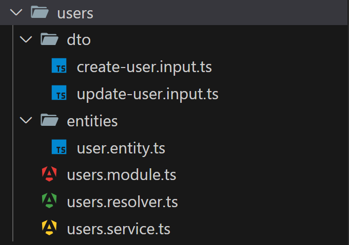
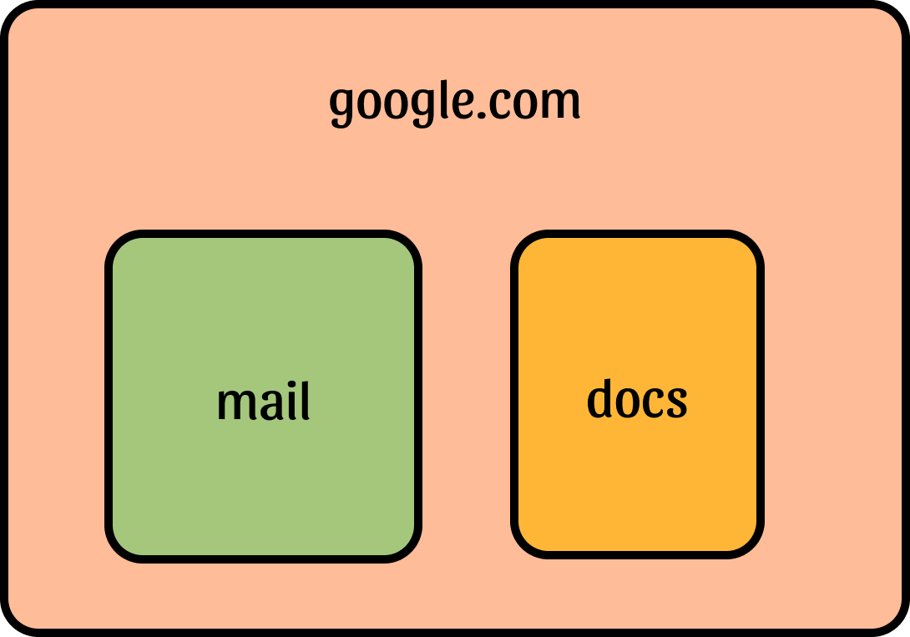

# [3장] 애플리케이션의 관문: 인터페이스

# 3.1 컨트롤러

- 컨트롤러(Controller)는 들어오는 요청(Request)을 받고 처리된 결과를 응답(Response)으로 돌려주는 인터페이스 역할을 한다.
- 엔드포인트 라우팅 메커니즘을 통해 각 컨트롤러가 받을 수 있는 요청을 분류한다.

> 💡 **엔드포인트 라우팅 메커니즘이란?**
>
> - 클라이언트 요청이 올바른 컨트롤러와 메서드로 전달되는 과정.
> - "어떤 URL에 어떤 요청이 오면, 어떤 컨트롤러의 어떤 메서드로 처리할지 결정하는 로직”.
> - NestJS가 `@Controller()`, `@Get()`, `@Post()` 등을 분석하여 적절한 메서드를 실행.
> - Reflect 메타데이터와 Express.js 라우터를 사용해 엔드포인트를 등록하고 매칭.
> - 동적 라우팅(`:id` 등)도 자동으로 처리 가능.

### 컨트롤로 생성

```bash
# Users 컨트롤러 생성
$ nest g controller Users

# Nest 구성 요소에 대한 약어 확인
$ nest -h

# CRUD 보일러플레이트 코드 생성
$ nest g resource [name]
```

<p align="center">
 
  <p align="center"><em> > CRUD 보일러플레이트로 생성 했을 때</em></p>
  </p>

<br />

# 3.1.1 라우팅

```tsx
// app.controller.ts

import { Confroller, GEt } from '@nestjs/common';
import { AppService } from './app.service';

@Controller() // 컨트롤러 클래스임을 명시. 루트 경로('/')가 생략됨.
export class AppController {
    constructor(pricate readonly appService: AppService) {}

    @Get('/hello') // 메서드 데코레이터
    getHello(): string {
        return this.appService.getHello();
    }
}
```

```tsx
💩 요청 : http://localhost:3000/

{
    "statusCode": 404,
    "message": "Cannot GET /",
    "error": "Not Found"
}

🌟 요청 : http://localhost:3000/hello
```

- `getHello()` 함수를 호출하기 위해서는 `@Get('/hello')` 데코레이터가 사용되었기 때문에 `/hello` 경로로 요청해야 한다.
- 루트 경로('/')에는 어떤 핸들러도 정의되어 있지 않아 404 에러가 발생하지만, `/hello` 경로로 요청하면 `getHello()` 함수가 정상적으로 호출된다.

# 3.1.2 와일드 카드 사용

- 라우팅 패스는 와일드 카드를 이용하여 작성할 수 있다.
- 다양한 상황에서 유연한 패턴 매칭을 가능하게 해주는 기능이다.
- 여러 요청을 일관된 방식으로 처리해야 할 때 매우 유용하다.

```tsx
@Controller("api")
export class AppController {
  @Get("users*")
  getAllUsers() {
    // users로 시작하는 모든 경로를 처리
    // 예: /api/users, /api/users/active, /api/users/123 등
    return "This route uses a wildcard";
  }
}
```

### 🚨 주의 사항

- 와일드카드 사용 시 라우트 순서가 중요하므로, 구체적인 라우트를 와일드카드 라우트보다 먼저 선언해야 한다.
- 너무 광범위한 와일드카드는 성능에 영향을 줄 수 있다.
- 디버깅이 어려워질 수 있으므로 적절히 문서화하는 것이 좋다.

### 구체적인 라우트를 와일드카드 라우트보다 먼저 선언하는 예제

```tsx
// products.controller.ts

import { Controller, Get, Param } from "@nestjs/common";

@Controller("products")
export class ProductsController {
  // 구체적인 라우트가 먼저 선언됨
  @Get("featured")
  getFeaturedProducts() {
    return { message: "특별 상품 목록입니다" };
  }

  // 특정 ID를 가진 상품을 위한 구체적인 라우트
  @Get(":id/details")
  getProductDetails(@Param("id") id: string) {
    return { message: `상품 ID ${id}의 상세 정보입니다` };
  }

  // 와일드카드 라우트는 더 구체적인 라우트 뒤에 선언
  @Get(":id*")
  getProductWildcard(@Param("id") id: string) {
    return { message: `와일드카드 경로로 상품 ID ${id}에 접근했습니다` };
  }

  // 가장 일반적인 와일드카드 라우트는 마지막에 선언
  @Get("*")
  getAllProductRoutes() {
    return { message: "모든 상품 관련 경로를 처리합니다" };
  }
}

// app.module.ts
@Module({
  imports: [
    // 구체적인 경로를 처리하는 모듈을 먼저 가져옵니다
    ProductsModule,
    UsersModule,
    // 와일드카드 라우트를 처리하는 모듈은 나중에 가져옵니다
    FallbackModule,
  ],
})
export class AppModule {}
```

## ❓ 와일드 카드는 실무에서 어떤 경우에 사용될까?

### 1. API 게이트웨이 라우팅

- API 게이트웨이 또는 프록시 서버를 구축할 때, 모든 API 요청을 특정 서비스로 라우팅하는 데 와일드카드 라우트를 사용할 수 있다.
- 이런 구성은 다수의 백엔드 서비스가 연동되는 마이크로서비스 아키텍처에서 유용하다.

```tsx
@Controller("api")
export class ApiController {
  @Get("*")
  handleApiRequests(@Req() req: Request, @Res() res: Response) {
    const apiUrl = `http://backend-service${req.url}`;
    this.httpService.get(apiUrl).subscribe((response) => {
      res.send(response.data);
    });
  }
}
```

- 이 코드는 들어오는 모든 `/api` 경로 요청을 `backend-service`로 프록시한다.

### 2. 404 에러 핸들링

- 웹 애플리케이션에서 존재하지 않는 경로에 대한 접근을 처리하기 위해 마지막 라우트로 와일드카드를 설정하여 모든 미처리 요청을 캡처할 수 있다.

```tsx
@Controller("*")
export class FallbackController {
  @Get()
  handleFallback() {
    return "This page does not exist.";
  }
}
```

- 이 컨트롤러는 어떤 라우트에도 매치되지 않는 모든 요청을 처리하며, 사용자에게 404 페이지가 없음을 알린다.

### 3. 로깅 및 모니터링

- 모든 요청에 대한 로깅을 구현하려면 와일드카드 라우트를 사용하여 들어오는 모든 요청을 로그에 기록할 수 있다.

```tsx
@Controller("*")
export class LoggingController {
  @Get()
  logRequest(@Req() req: Request) {
    console.log(`Incoming request for ${req.url}`);
    // 다른 컨트롤러로 요청을 전달하거나 처리
  }
}
```

- 이 설정은 개발 중 또는 운영 환경에서 모든 요청을 모니터링하는 데 사용될 수 있다.

<br />

# 3.1.3 요청 객체

- `@Req() request` : 전체 요청 객체에 접근.
- `@Param('id')`: URL에서 경로 변수 추출 (예: /users/123에서 123)
- `@Query('name')`: URL 질의 변수 추출 (예: /users?name=길동에서 '길동')
- `@Body()`: POST 요청의 본문 데이터 추출 (예: JSON 데이터)

```tsx
// 컨트롤러 파일 (예: users.controller.ts)
import {
  Controller,
  Get,
  Post,
  Body,
  Param,
  Query,
  Req,
  Res,
} from "@nestjs/common";
import { Request, Response } from "express";

@Controller("users")
export class UsersController {
  // 기본 GET 요청 처리
  @Get()
  getAllUsers(@Req() request: Request) {
    console.log("요청 URL:", request.url); // 요청 주소
    console.log("요청 방법:", request.method); // 요청 방법 (GET)
    console.log("요청 헤더:", request.headers); // 요청 머리말

    return { message: "모든 사용자 정보입니다!" };
  }

  // 경로 파라미터 사용
  @Get(":id")
  getUserById(@Param("id") id: string, @Req() request: Request) {
    console.log(`사용자 ID ${id}에 대한 정보 요청이 왔어요!`);
    return { userId: id, name: "홍길동" };
  }

  // 쿼리 파라미터 사용
  @Get("search")
  searchUsers(@Query("name") name: string) {
    console.log(`이름이 ${name}인 사용자를 찾고 있어요!`);
    return { result: [`${name}1`, `${name}2`] };
  }

  // POST 요청으로 데이터 전송
  @Post()
  createUser(@Body() userData: any, @Req() request: Request) {
    console.log("새 사용자 정보:", userData); // 요청 본문 데이터
    console.log("요청 헤더의 타입:", request.headers["content-type"]); // 어떤 형식으로 데이터가 왔는지

    return {
      message: "새 사용자가 생성되었어요!",
      user: userData,
    };
  }

  // 직접 응답 객체 다루기
  @Get("download")
  downloadFile(@Res() response: Response) {
    // 응답 객체를 직접 조작
    response.setHeader("Content-Type", "text/plain");
    response.send("여기에 파일 내용이 들어갑니다!");
  }
}
```

## 📨 Client에서 요청

```json
GET 요청: 브라우저에서 http://localhost:3000/users 접속
경로 파라미터: http://localhost:3000/users/123 접속
쿼리 파라미터: http://localhost:3000/users/search?name=길동 접속
POST 요청: Postman이나 fetch API로 본문에 JSON 데이터 포함해 요청
```

<br />

# 3.1.4 응답

- @Res데커레이터를 이용해서 Express응답 객체를 다룰 수 있다.

```tsx
import { Responce } from 'exporess';

@Get()
findAll(@Res() res: Responce) {
    const users = this.userService.findAll();

    return res.status(200).send(users);
}
```

## 응답 상태 코드를 변경하려면 ?

- `@HttpCode`

```tsx
import { HttpCode } from '@nestjs/common';

@HttpCode(202)
@Patch(':id')
@update(@Param('id) id: string, @Body() updateUserDto: UpdateUserDto) {
    return this.usersService.update(+id, updateUserDto);
}
```

- `Bad Request` 예외 처리

```tsx
import { BadRequestException } from '@nestjs/common';

@Get(':id')
@findOne(@Param('id) id: string) {
    if(+id < 1) {
        throw new BadRequestException('id는 0보다 큰 값이어야 합니다.');
    }

    return this.usersService.findOne(+id);
}
```

```bash
$ curl -X GET http://localhost:3000/users/0
{
    "statusCode": 400,
    "message": "id는 0보다 큰 값이어야 합니다.",
    "error": "Bad Request"
}
```

<br />

# 3.1.5 헤더

- Nest는 응답 헤더를 자동으로 구성해준다.
- 커스텀 헤더를 추가하고 싶다면 @Header 데커레이터를 사용하면 된다.

```bash
import { Header } from '@nestjs/common';

@Header('Custom', 'Test Header')
@Get(':id')
findOneWithHeader(@Param('id') id: string) {
    return this.usersService.findOne(+id);
}
```

```bash
$ curl -X GET http://localhost:3000/users/1 -v
Note: Unnecessary use of -X or --request, GET is already inferred.
*    Trying ::1...
* TCP_NODELAY set
* Connected to localhost (::1) port 3000 (#0)
> GET /users/1 HTTP1.1
> Host: localhost:3000
> User-Agent: curl/.64.1
> Accept: */*
>
< HTTP/1.1 200 OK
< X-Powered-By: Express
< Custom: Test Header
< Content-Type: text/html; charset=utf-8
```

<br />

# 3.1.6 리디렉션

- 요청을 보낸 클라이언트를 다른 페이지로 이동하고 싶은 경우 사용한다.
- @Redirect 데커레이터를 사용하면 쉽게 구현이 가능핟.

```tsx
import { Redirect } from '@nestjs/common';

@Redirect('https://nests.com', 301)
@Get(':id')
findOne(@Param('id') id: string) {
    return this.usersService.findOne(+id);
}
```

- 요청

```bash
$ curl -X GET http://localhost:3000/users/1 -v
Note: Unnecessary use of -X or --request, GET is already inferred.
*    Trying ::1...
* TCP_NODELAY set
* Connected to localhost (::1) port 3000 (#0)
> GET /users/1 HTTP1.1
> Host: localhost:3000
> User-Agent: curl/.64.1
> Accept: */*
>
< HTTP/1.1 301 Moved Permanently
< X-Powered-By: Express
< Custom: Test Header
< Location: https://nestjs.com
```

<br />

# 3.1.7 라우트 매개변수

- `라우트 매개변수`는 `패스 매개변수`라고도 한다.

```tsx
http://localhost:3000/users/1
```

- 1에 해당하는 부분은 유저ID로, 동적으로 구성된다. (경로를 구성하는 매개변수)
- 전달받은 매개변수는 함수안에서 `@Param`데커레이터로 주입받을 수 있다.

## 라우트 매개변수를 전달 받는 방법

### 1. 객체로 받는 방법

- params의 타입이 any이 되어 권장하지 않지만 라우트 매개변수의 타입이 항상 ;string이기 때문에 명시적으로 `{ [key: string]: string }`을 지정하여 사용할 수 있다.

```tsx
@Delete(':userId/memo/:memoId)
deleteUserMemo(@Param() params: { [key: string]: string }) {
    return `userId: ${params.userId}, memoId: ${params.memoId}`;
}
```

### 2. 라우팅 매개변수를 따로 받는 방법

- 일반적인 방법으로 , 라우팅 매개변수를 따로 받을 수 있다.
- `REST API`를 구상할 때는 라우팅 매개변수의 개수가 많지 않게 설계하기 때문에 따로 받아도 코드가 많이 길어지지 않는다.

```tsx
@Delete(':userId/memo/:memoId)
deleteUserMemo(
    @Param('userId') userId: string,
    @Param('memoId') memoId: string,
) {
    return `userId: ${userId}, memoId: ${memoId}`;
}
```

<br />

# 3.1.8 하위 도메인 라우팅

> 💡 **하위 도메인이란?**  
> • google.com(인터넷 주소:도메인)앞에 뭔가 붙는 것.  
> • `mail.google.com`, `docs.google.com`

<p align="center">
 </p>

- `google.com` 집 안에 여러 개의 `방(mail, docs)`이 있다고 생각해 보자.
- "방"마다 다른 기능을 만들 수 있다.
  - `api.example.com` → API 서버
  - `admin.example.com` → 관리자 페이지
  - `user.example.com` → 사용자 전용 페이지
- 이렇게 주소가 다르면, NestJS가 **"어느 방으로 들어왔는지"** 확인하고 다른 기능을 보여줄 수 있다.

## NestJS에서 하위 도메인 라우팅 하기

- nestjs가 `sub`자리에 들어오는 네임을 찾아서 해당하는 방으로 안내 해 준다.

```tsx
import { Controller, Get, Req, HostParam } from "@nestjs/common";
import { Request } from "express";

@Controller({ host: ":sub.example.com" }) // ← 하위 도메인 받기 (예: student.example.com, teacher.example.com)
export class SubdomainController {
  @Get()
  handleSubdomain(@HostParam("sub") subdomain: string, @Req() req: Request) {
    return `안녕! 너는 [${subdomain}.example.com]에서 왔구나!`;
  }
}
```

<br />

# 3.1.9 페이로드 다루기

- POST, PUT, PATCH 요청은 보통 처리에 필요한 페이로드(payload)데이터를 함께 실어 보내는 데, 이 데이터를 본문(body)이라고 한다.
- nestJS는 데이터 전송 객체(data transfer object, DTO)가 구현되어 있어 본분을 쉽게 다룰 수 있다.
- 클라이언트

```tsx
const payload = {
  name: "초코맛 쿠키",
  age: 7,
};

const response = await axios.post("http://localhost:3000/cookies", payload);
console.log("서버 응답:", response.data);
```

- 서버

```tsx
import { Controller, Post, Body } from "@nestjs/common";

@Controller("cookies")
export class CookieController {
  @Post()
  createCookie(@Body() data: { name: string; age: number }) {
    console.log("받은 데이터:", data);
    return { message: `${data.name} 쿠키 저장 완료!` };
  }
}
```

<br />

# 3.2 유저 서비스의 인터페이스

- 유저 서비스의 인터페이스를 정의하고 컨트롤러를 구현해본다.
- 먼저, 외부(프론트)에서 4가지의 요청을 받아 처리 한다.
- 각 요청에 대한 인터페이스

<table>
 <thead>
   <tr>
     <th>기능</th>
     <th>엔드포인트</th>
     <th>본문 데이터 예 (JSON)</th>
     <th>패스 매개변수</th>
     <th>응답</th>
   </tr>
 </thead>
 <tbody>
   <tr>
     <td>회원가입</td>
     <td>POST /users</td>
     <td>
       {<br>
       "name": "YOUR_NAME",<br>
       "email": "YOUR_EMAIL@gmail.com",<br>
       "password": "PASSWORD"<br>
       }
     </td>
     <td></td>
     <td>201</td>
   </tr>
   <tr>
     <td>이메일 인증</td>
     <td>POST /users/email-verify</td>
     <td>
       {<br>
       "signupVerifyToken": "임의의 문자열"<br>
       }
     </td>
     <td></td>
     <td>201<br>액세스 토큰</td>
   </tr>
   <tr>
     <td>로그인</td>
     <td>POST /users/login</td>
     <td>
       {<br>
       "email": "YOUR_EMAIL@gmail.com",<br>
       "password": "PASSWORD"<br>
       }
     </td>
     <td></td>
     <td>201<br>액세스 토큰</td>
   </tr>
   <tr>
     <td>회원 정보 조회</td>
     <td>GET /user/:id</td>
     <td></td>
     <td>id: 유저 생성 시 만들어진 유저 ID. 이메일이 아니라 임의의 문자열</td>
     <td></td>
   </tr>
 </tbody>
</table>

## 유저 컨트롤러

```tsx
// users.controller.ts

import { Body, Controller, Get, Param, Post, Query } from "@nestjs/common";
import { CreateUserDto } from "./dto/create-user.dto";
import { UserLoginDto } from "./dto/user-login.dto";
import { VerifyEmailDto } from "./dto/verifye-email.dto";
import { UserInfo } from "./UserInfo";

@Controller("users")
export class UserController {
  @Post()
  async create(@Body() dto: CreateUserDto): Promise<void> {
    console.log(dto);
  }

  @Post("/email-verify")
  // @Query: url에 포함되어 전달되는 쿼리 매개변수.
  async verifyEmail(@Query() dto: VerifyEmailDto): Promise<void> {
    console.log(dto);
    return;
  }

  @Post("/login")
  // UserLoginDto :  유저가 입력한 데이터는 본문으로 전달된다.
  async login(@Body() dto: UserLoginDto): Promise<string> {
    console.log(dto);
    return;
  }

  @Get("/:id")
  async getUserInfo(@Param("id") userId: string): Promise<UserInfo> {
    console.log(userId);
    return;
  }
}
```

> 💡 **관점 지향 프로그래밍 (aspect-oriented programming, AOP)**  
> • 유효성 검사, 로깅, 보안, 트랜잭션과 같이 애플리케이션 전반에 걸쳐 제공해야 하는 공통 요소를 `횡단관심사(cross-cutting concern)`라고 한다.  
> • 횡단관심사를 따로 분리하지 않고 사용하면 응집도가 떨어지고 유지보수가 어렵게 되는데 이를 해결하기 위해 관점 지향 프로그래밍 패러다임을 사용한다.  
> • Nest에서 대표적인 컴포넌트로 `인터셉터(interceptor)`가 있다.  
> • Nest는 전역으로 적용하지 않고 특정 컴포넌트에서만 적용할 때에는 데커레이터를 사용하여 AOP를 구현한다.
