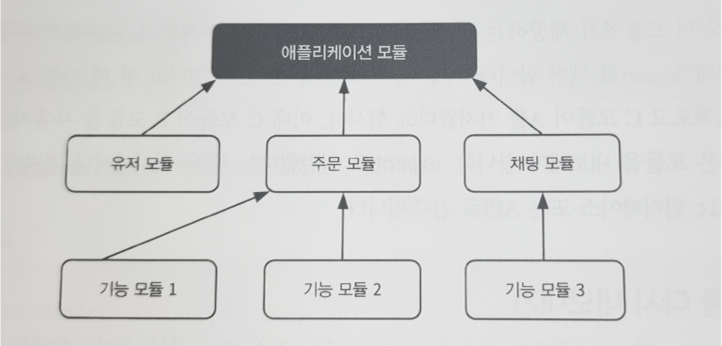
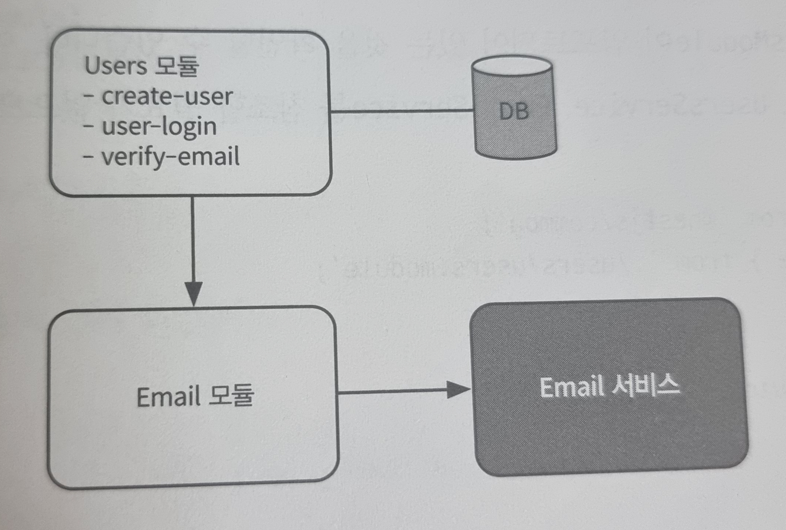

# [5장] SW 복잡도를 낮추기 위한 모듈 설계

# 5.1 모듈: 응집성 있는 설계

- 모듈(Module)이란, 일반적으로 여러 컴포넌트를 조합하여 큰 작업을 수행 할 수 있게 하는 단위를 말한다.
- Nest 애플리케이션이 실행되기 위해서는 하나의 루트(AppModule) 모듈이 존재하고 루트 모듈은 다른 모듈들로 구성된다.
- 모듈로 쪼개는 이유는 여러 모듈에 각기 맡은 바 책임을 나누고 응집도를 높이기 위함이다.
- `마이크로서비스 아키텍처`의 관점에서, 모듈이 커지면 하나의 마이크로서비스로 분리할 수도 있을 것이다.
- 🚨 응집도를 높이는 작업을 게을리하면 의존관계가 복잡한 코드로 변함.

<p align="center">
 
  <p align="center"><em> > 출처 : NestJS로 배우는 백엔드 프로그래밍  p.91</em></p>
  </p>

<br />

## @Module 데커레이터

```tsx
export declare function Module(metadata: ModuleMetadata): ClassDecorator;

export interface ModuleMetadata {
  imports?: Array<
    Type<any> | DynamicModule | Promise<DynamicModule> | ForwardReference
  >;
  controllers?: Type<any>[];
  providers?: Provider[];
  exports?: Array<
    | DynamicModule
    | string
    | symbol
    | Provider
    | ForwardReference
    | Abstract<any>
    | Function
  >;
}
```

- `imports`: 모듈에서 사용하기 위한 프로바이더를 가지고 있는 다른 모듈을 가져온다.
- `controllers/providers`: 모듈 전반에서 컨트롤러와 프로바이더를 사용할 수 있도록 Nest가 객체를 생성하고 주입할 수 있게 해준다.
- `exports`: 현재 모듈에서 제공하는 컴포넌트를 다른 모듈에서 사용해야 할 경우, 어디에서나 가져다 쓸 수 있으므로 public 인터페이스 또는 API로 간주된다.

<br />

## 5.1.1 모듈 다시 내보내기

- 가져온 모듈은 다시 내보내기가 가능하다.

```tsx
+-------------------+
|     AppModule     |
|-------------------|
| imports:          |
| - CoreModule      |
+-------------------+
        |
        v
+-------------------+
|    CoreModule     |
|-------------------|
| imports:          |
| - CommonModule    |
|-------------------|
| exports:          |
| - CommonModule    |
+-------------------+
        |
        v
+-------------------+
|   CommonModule    |
|-------------------|
| 제공하는 기능들    |
+-------------------+
```

### **✍️ 예제 코드**

- **CommonModule**

```tsx
@Module({
  providers: [CommonService],
  exports: [CommonService],
})
export class CommonModule {}
```

- CommonService

```tsx
@Injectable()
export class CommonService {
  hello(): string {
    return "Hello from CommonService";
  }
}
```

- **CoreModule**

```tsx
@Module({
  imports: CommonModule ],
  exports: [ CommonModule ], // CommonModule을 다시 내보내기
})
export class CoreModule {}
```

- **AppModule**

```tsx
@Module({
  imports: [CoreModule], // CommonModule을 직접 가져오지 않아도 사용 가능
  controllers: [AppController],
  providers: [AppService],
})
export class AppModule {}
```

<br />

## 5.1.2 전역 모듈

- 헬퍼와 같은 공통 기능이나 DB 연결과 같은 전역적으로 쓸 수 있어야 하는 프로바이더가 필요한 경우 전역 모듈로 제공한다.
- `@Global` 데커레이터 선언만으로 적용된다.
- 전역 모듈은 루트 모듈이나 코어 모듈에서 한번만 등록 해야한다.

```tsx
@Global()
@Module({
  providers: [CommonService],
  exports: [CommonService],
})
export class CommonModule {}
```

- 🚨 응집도가 떨어지지 않게 꼭 필요한 기능만 모아 전역 모듈로 사용하는 주의가 필요하다.

<br />
<br />

# 5.2 유저 서비스의 모듈 분리

<p align="center">
 
  <p align="center"><em> > 출처 : NestJS로 배우는 백엔드 프로그래밍  p.95</em></p>
  </p>
