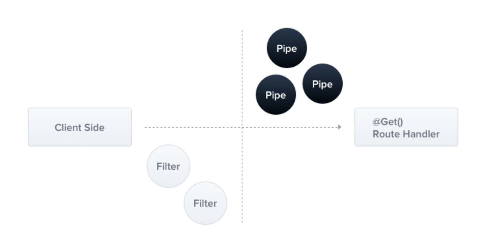

# [7장] 파이프와 유효성 검사: 요청이 제대로 전달되었는가

# 7.1 파이프

<p align="center">
 
  <p align="center"><em> > 출처 : [NestJS 공식 홈페이지](https://docs.nestjs.com/pipes)</em></p>
  </p>


- 파이프(pipe)는 요청이 라우터 핸들러로 전달되기 전에 요청 객체를 변환할 수 있는 기회를 제공한다.
- `미들웨어`의 역할과 비슷하지만 미들웨어는 현재 요청이 어떤 핸들러에서 수행되는지, 어떤 매개변수를 가지고 있는지에 대한 실행 콘텐스트를 알지 못한다는 차이점이 있다.

  <br />

## 📌 파이프 사용 목적

### 1. 변환(transformation)

- 입력 데이터를 원하는 형식으로 변환.

```jsx
/users/user/1
- 내의 경로 매개변수 문자열 1을 정수로 변환
```

- Class로 전달하는 방법
  ```tsx
  @Get(':id')
  findOne(@Param('id', ParseIntPipe) id: number){
      return this.usersService.findOne(id);
  }
  ```
- 파이프 객체를 직접 생성하여 전달하는 방법 :

  - 생성할 파이프 객체의 동작을 원하는 대로 바꾸고자 할 때 사용.

  ```tsx
  @Get(':id')
  findOne(@Param('id', new ParseIntPipe({ errorHttpStatusCode: HttpStatus.NOT_ACCEPTABLE })) id: number){
      return this.usersService.findOne(id);
  }
  ```

  <br />

### 2. 유효성 검사(validation)

- 입력 데이터가 사용자가 정한 기준에 유효하지 않은 경우 예외 처리.

## 📦 @nestjs/common 패키지에 내장되어 있는 파이프

- **`ValidationPipe`**
  - - 들어오는 요청 데이터의 유효성 검사 .
  - class-validator와 함께 사용하여 DTO 클래스에 정의된 제약 조건에 따라 데이터 검증.
- **`ParseIntPipe`**
  - 문자열을 정수로 변환.
  - 변환할 수 없는 경우 예외 발생.
- **`ParseFloatPipe`**
  - 문자열을 부동 소수점 숫자로 변환.
- **`ParseBoolPipe`**
  - 문자열을 불리언 값으로 변환.
- **`ParseArrayPipe`**
  - 값을 배열로 변환하고 선택적으로 배열 항목을 변환.
- **`ParseUUIDPipe`**
  - 문자열이 UUID인지 확인.
- **`ParseEnumPipe`**
  - 값이 지정된 열거형의 유효한 값인지 확인.
- **`DefaultValuePipe`**

  - 입력 값이 undefined인 경우 기본값을 제공.

  <br />

# 7.2 파이프의 내부 구현 이해하기

- ValidationPipe의 활용 방안에 대해 알아보면서 추후 커스텀 파이프가 필요할 때 어떻게 만들면 될지 학습할 수 있다.

```tsx
// validation.pipe.ts

@Injectable()
export class ValidationPipe implements PipeTransform {
  transform(value: any, metadata: ArgumentMetadata) {
    console.log(metadata);
    return value;
  }
}
```

- 커스텀 파이프는 `PipeTransform` 인터페이스를 상속받은 클래스에 `@Injectable` 데커레이터를 붙여 주면 된다.
- pipeTransform의 원형

  ```tsx
  export interface PpeTransform<T = any, R = any> {
    transform(value: T, metadata: ArgumentMetadata): R;
  }
  ```

  - `value`: 현재 파이프에 전달된 인수
  - `metadata`: 현재 파이프에 전달된 인수의 메타데이터
  - ArgumentMetadata:

    ```tsx
    export interface ArgumentMetadata {
        readnly type: Parmtype;
        redonly metatype?: Type<any> | undfinde;
        redonly data?: string | undefined;
    }

    export decdlare type Paramtype = 'body' | 'query' | 'param'| 'custom';
    ```

    - `type`: 파이프에 전달된 인수가 본문(body)인지, 쿼리(query) 매개변수인지, 매개변수(param인지 아니면 커스텀(custom) 매개변수인지를 나타낸다.
    - `metatype`: 라우트 핸들러에 정의된 인수의 타입을 알려준다. 핸들러에서 타입을 생략하거나 바닐라 자바스크립트를 사용하면 undefined가 된다.
    - `data`: 데커레이터에 전달된 문자열(매개변수 이름)

# [ 쉬어가는 페이지 - 인증 VS 인가 ]

## 인증(Authentication)

- 인증은 어떤 개체(사용자 또는 장치)의 신원을 확인하는 과정이다.
- 신분증, 여권 등 = 아이디/비밀번호

<p align="center">
 
  <p align="center"><em> > 출처 : ChatGPT_Image</em></p>
  </p>

<br />

## 인가(Authorization)

- 인가는 어떤 개체가 어떤 리소스에 접근할 수 있는지 또는 어떤 동작을 수행할 수 있는지를 검증 한다.
- = 접근권한
- 공연 티켓 = JWT

<p align="center">
 
  <p align="center"><em> > 출처 : ChatGPT_Image</em></p>
  </p>
