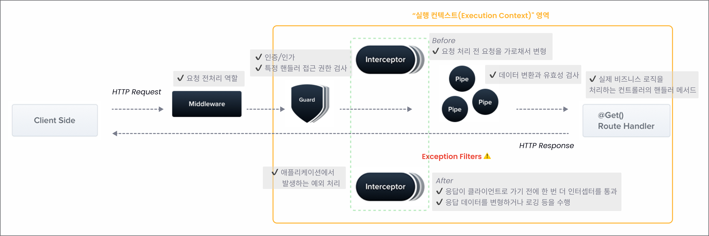
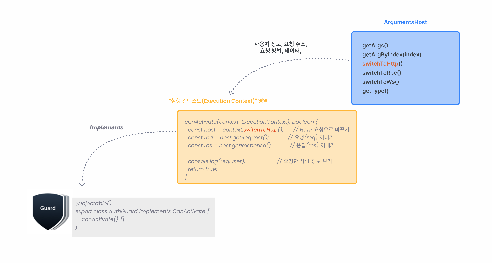

# [10장] 권한 확인을 위한 가드: JWT 인증/인가

# 10.1 가드

- 인가는 가드(Guard)를 이용하여 구현할 수 있는 좋은 사례다.
- 인가 :
  - 인증을 통과한 유저가 요청한 기능을 사용할 권한이 있는지 판별하는 것.
- 인증은 미들웨어를 사용하고 인가는 가드를 사용한다.

<br />

# 10.2 가드를 이용한 인가

- 가드는 `CanActivate` 인터페이스를 구현해야 한다.

```tsx
@Injectable()
export class AuthGuard implements CanActivate {
  canActivate() {}
}
```

- CanActivate 함수는 `ExecutionContext 인스턴스`를 인수로 받는다.
- ExecutionContext는 `ArgumentsHost`를 상속 받는데, 요청과 응답에 대한 정보를 가지고 있다.

<br />

# 🌊 NestJS 생명 주기

<p align="center">
 
  <p align="center"><em> > 출처 : Made in Roxie</em></p>
  </p>

## 🧁 ExecutionContext vs ArgumentsHost

| 항목        | ExecutionContext                             | ArgumentsHost              |
| ----------- | -------------------------------------------- | -------------------------- |
| 목적        | 요청의 전체 상황 + 메서드/컨트롤러 정보 포함 | 요청 인자만 접근           |
| 포함 여부   | ArgumentsHost를 확장해서 만듦                | 더 기본적인 구조체         |
| 주요 사용처 | 가드, 인터셉터 등 고급 처리                  | 기본 요청 처리 또는 전환용 |

<p align="center">
 
  <p align="center"><em> > 출처 : Made in Roxie</em></p>
  </p>

| 항목               | 설명                                                 |
| ------------------ | ---------------------------------------------------- |
| **getClass()**     | 지금 실행되는 컨트롤러 클래스 (ex: `UserController`) |
| **getHandler()**   | 실행될 메서드 (ex: `findAll()`)                      |
| **getArgs()**      | 요청 객체들 (`req`, `res`, `next`, `context`, 등등)  |
| **switchToHttp()** | HTTP 요청에 관련된 데이터로 전환                     |
| **switchToRpc()**  | RPC 요청일 때 전환 (Microservice 등)                 |
| **switchToWs()**   | WebSocket용 전환                                     |
| **getType()**      | 현재 실행 환경 (http / rpc / ws 등)                  |

<br />

## 🔍 미들웨어와 가드의 차이점

| 항목               | 가드 (`CanActivate`)     | 미들웨어                              |
| ------------------ | ------------------------ | ------------------------------------- |
| 구현 방식          | `implements CanActivate` | `(req, res, next)` 함수               |
| 인수               | `ExecutionContext`       | `Request`, `Response`, `NextFunction` |
| 실행 콘텍스트 접근 | ✅ 가능                  | ❌ 불가능                             |
| 실행 위치          | 요청이 들어오자마자      | 라우터(컨트롤러) 실행 바로 직전       |
| 할 수 있는 일      | 로깅, 공통 처리          | 인증/권한 검사(보안 작업)             |

```tsx
// 미들웨어: 누가 오든 기록만 함
function logger(req, res, next) {
  console.log('누군가 요청했어요!');
  next(); // 다음 단계로 넘어가!
}

// 가드: 진짜 들어갈 수 있는 사람만 통과!
canActivate(context) {
  const user = context.getUser();
  return user.isLoggedIn; // 로그인한 사람만 통과!
}
```

<br />

## 🎯 가드를 미들웨어처럼 쓰면 안 되는 이유

"가드는 `CanActivate` 인터페이스를 구현하며, 이 인터페이스는 `ExecutionContext`를 인수로 받아 실행 콘텍스트에 접근할 수 있다.
반면, 미들웨어는 단순히 `req`, `res`, `next` 객체만을 인수로 받아 실행 콘텍스트 정보에 접근할 수 없다."

<br />

# 10.3 인증

- 사용자의 리소스를 보호하기 위해서는 서버에 접속하는 클라이언트가 리소스의 주인인지 확인하는 인증 절차를 거친다.

<br />

## 10.3.1 세션 기반 인증

- 세션 기반 인증 (Session-based Authentication)이란?
  - 클라이언트가 로그인하면 서버가 세션 ID를 생성하여 서버의 메모리나 저장소에 저장하고, 클라이언트에게는 ID를 쿠키로 전달한다.
  - 클라이언트는 이후 요청 시 쿠키에 담긴 세션 ID를 함께 보내고, 서버는 이 ID로 사용자 정보를 찾아 인증을 수행한다.
  - 서버에서 상태(state)를 유지해야 하므로, **`상태 기반 인증`**이라고도한다.
- 예제
  ```bash
  $ npm install express-session @nestjs/passport passport passport-local
  ```
  ```tsx
  // auth/auth.module.ts
  @Module({
    imports: [
      // 세션 기반 인증 사용
      PassportModule.register({ session: true }),
    ],
    controllers: [AuthController],
    providers: [LocalStrategy, AuthService],
  })
  export class AuthModule {}
  ```

<br />

## 10.3.2 토큰 기반 인증

- 토큰 기반 인증 (Token-based Authentication)이란?
  - 로그인하면 서버가 고유한 토큰을 생성해 클라이언트에 전달한다.
  - 클라이언트는 이 토큰을 저장하고, 이후 요청 시 `Authorization` 헤더 등에 실어 서버에 전달 한다.
  - 서버는 토큰의 유효성을 검사하여 인증을 수행한다.
  - 서버가 세션을 저장하지 않기 때문에 `무상태(stateless)`이다.
- 토큰 기반 인증 + JWT 예제

  ```bash
  $ npm install @nestjs/jwt passport-jwt
  ```

  ```tsx
  // auth/jwt.strategy.ts
  @Injectable()
  export class JwtStrategy extends PassportStrategy(Strategy) {
    constructor() {
      super({
        jwtFromRequest: ExtractJwt.fromAuthHeaderAsBearerToken(),
        secretOrKey: "jwt-secret",
      });
    }

    async validate(payload: any) {
      return { userId: payload.sub, username: payload.username };
    }
  }

  // auth/auth.service.ts
  @Injectable()
  export class AuthService {
    constructor(private jwtService: JwtService) {}

    async login(user: any) {
      const payload = { username: user.username, sub: user.userId };
      return {
        access_token: this.jwtService.sign(payload),
      };
    }
  }

  // auth/auth.module.ts
  @Module({
    imports: [
      JwtModule.register({
        secret: "jwt-secret",
        signOptions: { expiresIn: "60m" },
      }),
      PassportModule,
    ],
    providers: [AuthService, JwtStrategy],
  })
  export class AuthModule {}
  ```

<br />

## 🆚 세션 vs 토큰 vs JWT 차이점 비교

| 항목                    | 세션 기반 인증                | 토큰 기반 인증 (JWT 포함)             |
| ----------------------- | ----------------------------- | ------------------------------------- |
| 저장 위치               | 서버 (메모리, DB 등)          | 클라이언트 (브라우저, 앱 등)          |
| 서버 상태 유지 필요     | ✅ 필요 (stateful)            | ❌ 불필요 (stateless)                 |
| 확장성 (scale-out) 문제 | 세션 공유 필요 (ex. Redis)    | 없음 (자체 포함된 정보로 인증)        |
| 클라이언트 부담         | 적음                          | 많음 (토큰 저장/갱신 책임 클라이언트) |
| 보안 측면               | 쿠키 탈취 위험                | 토큰 탈취 시 만료 전까지 사용 가능    |
| 사용 예시               | 내부 시스템, 관리자 페이지 등 | REST API, 모바일 앱 등                |
