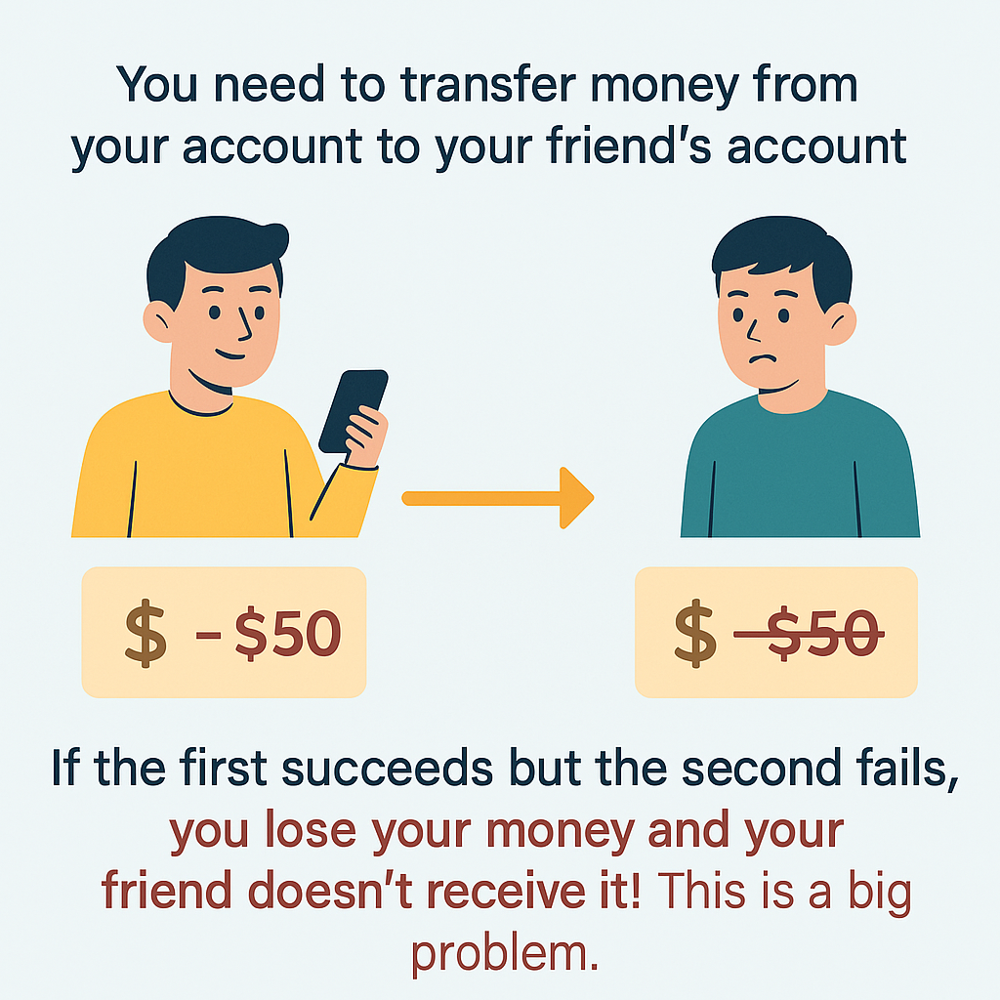
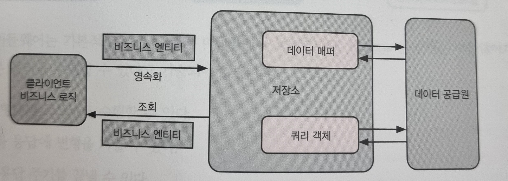

# [8장] 영속화: 데이터를 기록하고 다루기

- Node.js 드라이버가 존재하는 데이터베이스가 있다면 적용할 수 있다.
- RDBMS, NoSQL, ORM(TypeORM, Sequelize 등)을 지원한다.

> **💡 영속화란 ?**

- 일반적인 의미로, 어떤 데이터를 메모리에서 사라지지 않도록, 파일이나 데이터베이스 같은 영구 저장소에 저장하는 과정.
  >

# TypeORM이란?

공식 홈페이지 : https://typeorm.io/

- 데이터베이스와 프로그램을 연결해주는 도구.
- SQL언어를 직접 사용하지 않고, 언어(JS,TS)로 작성한 코드를 SQL로 변환한다.

## 📌 사용 방법

```tsx
// user.entity.ts

@Entity()
class User {
  @PrimaryGeneratedColumn()
  id: number;

  @Column()
  name: string;

  @Column()
  age: number;
}
```

- 데이터베이스에는 `user`라는 이름의 테이블과 `id`, `name`, `age`라는 컬럼이 생성된다.

## 🌟 장점

- 복잡한 데이터베이스 작업을 간단하게 만들어 준다.
- 코드를 더 쉽게 작성하고, 타입스크립트와 함께 작성하여 실수를 줄이고, 개발자가 데이터베이스보다 실제 프로그램 기능에 더 집중 할 수 있게 한다.

# 8.1 MySQL 데이터베이스 설정

- DBeaver 설정 방법
  - https://daslyee.tistory.com/112

# 8.2 TypeORM으로 데이터베이스 연결

- TypeORM 연결 방법
  https://docs.nestjs.com/techniques/database#typeorm-transactions

```bash
$ pnpm add typeorm @nestjs/typeorm mysql2
```

```tsx
import { Module } from "@nestjs/common";
import { ConfigModule } from "@nestjs/config";
import { TypeOrmModule } from "@nestjs/typeorm";

@Module({
  imports: [
    TypeOrmModule.forRootAsync({
      imports: [ConfigModule],
      useFactory: (configService: ConfigService) => {
        const type = configService.get<string>(envVariableKeys.dbType);
        const host = configService.get<string>(envVariableKeys.dbHost);
        const port = configService.get<number>(envVariableKeys.dbPort);
        const username = configService.get<string>(envVariableKeys.dbUsername);
        const password = configService.get<string>(envVariableKeys.dbPassword);
        const database = configService.get<string>(envVariableKeys.dbDatabase);

        if (!type || !host || !port || !username || !password || !database) {
          throw new Error("Missing required database configuration");
        }

        return {
          type: type as "mysql",
          host,
          port: Number(port),
          username,
          password,
          database,
          entities: [__dirname + "/**/*.entity{.ts,.js}"],
          synchronize: true,
        };
      },
      inject: [ConfigService],
    }),
  ],
})
export class AppModule {}
```

> 📌 synchronize 옵션을 true로 지정하면 서비스가 실행되고 데이터베이스가 연결될 때 데이터베이스가 초기화 되므로 절대 프로덕션에서는 true로 지정하면 안된다.

# 8.4 트랜잭션 적용

- TypeORM에서 트랜잭션을 사용하는 방법은 `QueryRunner`를 이용하여 단일 DB 커넥션 상태를 생성하고 관리하는 방법과, `transaction 함수`를 직접 사용하는 2가지 방법이 있다.

# ❓ 트랜잭션 이란?

- 트랜잭션은 여러 작업을 한 번에 처리하고, 중간에 실패하면 아무 일도 안 한 것처럼 되돌리는 것을 말한다.

<p align="center">
 
  <p align="center"><em> > 출처 : ChatGPT Image</em></p>
  </p>

```bash
1. 내 계좌에서 돈이 빠져 나간다
2. 친구 계좌에 돈이 들어 간다.
```

## 트랜잭션의 특징(ACID)

- **`원자성(Atomicity)`**: 모 아니면 도! 전체가 성공하거나 아무 일도 안 일어난 것처럼 돌아가거나.
- **`일관성(Consistency)`**: 데이터는 항상 규칙을 지킨다. (예: 계좌 잔액은 마이너스가 될 수 없다)
- **`격리성(Isolation)`**: 여러 트랜잭션이 동시에 실행되도 서로 방해하지 않는다.
- **`지속성(Durability)`**: 트랜잭션이 완료되면 그 결과는 안전하게 저장된다.

## 8.4.1 QueryRunner를 사용하는 방법

- QueryRunner를 이용하면 트랜잭션을 완전히 제어할 수 있다.

```tsx
import { Injectable } from "@nestjs/common";
import { InjectDataSource } from "@nestjs/typeorm";
import { DataSource } from "typeorm";

@Injectable()
export class UserService {
  constructor(@InjectDataSource() private readonly dataSource: DataSource) {}

  async createUserWithProfile(userData, profileData) {
    // 트랜잭션 시작!
    const queryRunner = this.dataSource.createQueryRunner();
    await queryRunner.connect();
    await queryRunner.startTransaction();

    try {
      // 1. 유저 만들기
      const user = await queryRunner.manager.save("User", userData);

      // 2. 프로필 만들기
      profileData.userId = user.id;
      await queryRunner.manager.save("Profile", profileData);

      // 모든 작업 성공! => 커밋!!
      await queryRunner.commitTransaction();
      return user;
    } catch (err) {
      // 중간에 에러 발생!! => 롤백!!
      await queryRunner.rollbackTransaction();
      throw err;
    } finally {
      // 연결 정리
      await queryRunner.release();
    }
  }
}
```

## 8.4.2. transaction 함수를 직접 이용하는 방법

- dataSource 객체 내의 transaction 함수를 바로 이용하는 방법이다.
- transaction 메서드는 `EntityManager`를 콜백으로 받아 사용자가 어떤 작업을 수행할 함수를 작성 할 수 있게 한다.

> transaction 메서드는 주어진 함수 실행을 트랜잭션으로 래핑합니다. 모든 데이터베이스 연산은 제공된 엔티티 매니저를 이용하여 실행해야 합니다.

```tsx
import { Injectable } from "@nestjs/common";
import { InjectDataSource } from "@nestjs/typeorm";
import { DataSource } from "typeorm";
import { User } from "./entities/user.entity";
import { Profile } from "./entities/profile.entity";

@Injectable()
export class UserService {
  constructor(@InjectDataSource() private readonly dataSource: DataSource) {}

  async createUserWithProfile(userData, profileData) {
    // 트랜잭션 시작
    return this.dataSource.transaction(async (manager) => {
      // 1. 유저 저장
      const user = await manager.save(User, userData);

      // 2. 프로필 저장 (user.id 연결)
      const profile = new Profile();
      profile.userId = user.id;
      profile.nickname = profileData.nickname;

      // 트랜잭션 안에서 DB 조작
      // save()를 여러 번 하더라도 하나라도 실패하면 전체 롤백
      await manager.save(Profile, profile);

      return user;
    });
  }
}
```

# 8.5 마이그레이션

> '코드에 적은 테이블 설계'를 DB에 반영하는 안전한 방법!

- 넓은 의미에서 `마이그레이션(migration)`은 애플리케이션이 구동 되는 OS를 바꾸거나 데이터베이스를 MySQL에서 Oracle로 바꾸는 것과 같이 인프라를 교체하는 것을 포함한다.
- TypeORM은 마이그레이션을 쉽고 안전하게 하는 방법을 제공한다.

# ❓ 마이그레이션 없이도 TypeORM으로 DB를 만들고 쓸 수 있는데 마이그레이션을 사용하는 이유는?

- **로컬 환경**에서는 Entity파일을 읽어서 TypeOrmModule을 설정하여 자동으로 DB를 생성할 수 있다.

```tsx
// app.module.ts

TypeOrmModule.forRoot({
  ...,
  synchronize: true,  // TypeORM이 자동으로 DB 테이블 생성.
})
```

- **운영 환경**에서는 테이블 구조가 변경되거나, 변경된 기록을 추적하기 힘들고 자동으로 변경되면 큰 사고의 위험이 있으므로, `synchronize: false` 로 설정하고 마이그레이션 파일을 따로 생성하여 사용하는 것을 권장한다.
- 마이그레이션을 사용하면
  ```tsx
  • 테이블 변경 내역 추적
  • 롤백 가능
  • 팀 협업에 강함
  ```

## 🧭 전체 흐름

### 1. CLI 설정하기 (typeorm 명령어를 쓰기 위한 설정)

```json
// package.json

"scripts": {
  "typeorm": "typeorm-ts-node-commonjs"
}
```

### 2. `ormconfig.ts` 대신 `data-source.ts` 사용하기 (TypeORM v0.3 이상)

```tsx
// src/data-source.ts

import { DataSource } from "typeorm";
import { User } from "./user/user.entity"; // 예시 엔티티

export const AppDataSource = new DataSource({
  type: "mysql",
  host: "localhost",
  port: 3306,
  username: "root",
  password: "",
  database: "test",
  entities: [User],
  migrations: ["src/migrations/*.ts"],
  synchronize: false, // 실서버에서는 꼭 false!
});
```

### 3. 엔티티 만들기 (예: User)

```tsx
// src/user/user.entity.ts

import { Entity, Column, PrimaryGeneratedColumn } from "typeorm";

@Entity()
export class User {
  @PrimaryGeneratedColumn()
  id: number;

  @Column()
  name: string;
}
```

### 4. 마이그레이션 파일 생성하기

```bash
# User 엔티티를 기반으로 CreateUserTable이라는 마이그레이션 파일을 src/migrations 폴더에 생성
$ npx typeorm migration:generate src/migrations/CreateUserTable -d src/data-source.ts
```

### 5. 마이그레이션 실행하기 (DB에 테이블 실제 생성)

```bash
$ npx typeorm migration:run -d src/data-source.ts
```

### 6. 마이그레이션 되돌리기 (rollback)

```bash
$ npx typeorm migration:revert -d src/data-source.ts
```

# [쉬어 가는 페이지] 저장소 패턴

- 저장소 패턴(Repository Pattern)은 데이터베이스와 같은 저장소를 다루는 로직을 데이터 레이어로 분리하여 핵심 비즈니스 로직에 집중할 수 있도록 한다.
- 여기서 저장소는 `예: UserRepository`를 가르킨다.

<p align="center">
 
  <p align="center"><em> > 출처 : p.151 NestJS로 배우는 백엔드 프로그래밍</em></p>
  </p>
