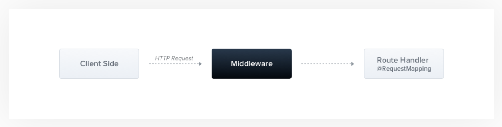

# [9장] 요청 처리 전에 부가 기능을 수행하기 위한 미들웨어

# 9.1 미들웨어

- 미들웨어(Middleware)는 라우트 핸들러가 클라이언트의 요청을 처리하기 전에 수행되는 컴포넌트를 말한다.

<p align="center">
 
  <p align="center"><em> > 출처 : [NestJS 공식 홈페이지](https://docs.nestjs.com/middleware)</em></p>
  </p>
 
### ⚙️ 미들웨어가 수행하는 동작

- 어떤 형태의 코드라도 수행할 수 있다.
- 요청과 응답에 변형을 가할 수 있다.
- 요청/응답 주기를 끝낼 수 있다.
- 여러 개의 미들웨어를 사용한다면 next()로 호출 스택상 다음 미들웨어에 제어권을 전달한다.

> 💡 현재 미들웨어가 응답 주기를 끝내지 않을 것이라면 반드시 next()를 호출해야 한다.  
> 그렇지 않으면 애플리케이션은 아무것도 할 수 없는 상태가 된다.

### 🌟 미들웨어를 활용하여 수행할 수 있는 작업

- 쿠키 파싱
  - 쿠키를 파싱하여 사용하기 쉬운 데이터 구조로 변경.
  - 라우터 핸들러가 매번 쿠키 파싱 ❌
- 세션 관리
  - 세션 쿠키를 찾아서 세년의 상태를 조회해서 요청에 세션 정보 추가.
  - 이를 통해 다른 핸들러가 세션 객체를 이용할 수 있다.
- 인증/인가
  - 사용자가 서비스에 접근 가능한 권한이 있는지 확인.
  - Nest는 인가를 구현할 때 가드를 이용하도록 권장한다.
- 본문 파싱
  - POST/PUT 요청으로 들어오는 JSON 타입, 파일 스트림과 같은 데이터를 유형에 따라 읽고 해석한 다음 매개변수에 넣는 작업.
- 이 외 필요한 기능이 있다면 직접 구현 가능.

# 9.2 Logger 미들웨어

- 미들웨어는 함수로 작성하거나 `NestMiddleware` 인터페이스를 구현한 클래스로 작성할 수 있다.

```tsx
// logger.middleware.ts

import { Injectable, NestMiddleware } from '@nestjs/common';
import { Request, Response, NextFunction } from 'expres';

@Injectable()
export class LoggerMidleware implements NesstMiddleware {
    use(req Request, res: Response, next: NextFunction) {
        // '/users'로 요청이 들어왔을 경우 실행.
        consoole.log('Request...');
        next();
    }
}
```

```tsx
// app.module.ts

import { Module, MiddlewareConsumer, NesstModule } from '@nestjs/common';
import { LoggerMiddleware } from ./logger/logger.middleware';
import { UsersModule } from './users/users.module';

@Module({
  imports: [UsersModule],
})
export class AppModule implements NesstModule {
    // configure 함수를 통해 미들웨어 설정.
    configure(consumer: MiddlewareConsumer): any {
        consumer
            // 사용할 미들웨어를 apply()함수로 등록
            .apply(LoggerMiddleware)
            // '/users' 경로에서만 LoggerMiddleware 실행.
            .forRoutes('/users');
    }
}
```

# 9.3 MiddlewareConsumer

- `MiddlewareConsumer`는 어떤 미들웨어를 어디에 적용할지 결정하는 도우미 역할을 한다.

## apply 메서드

1. 1개 이상 미들웨어 적용 방법

```tsx
configure(consumer: MiddlewareConsumer): any {
        consumer
            .apply(LoggerMiddleware, Logger2Middleware)
            .forRoutes('/users');
    }
```

1. 미들웨어를 적용하지 않을 라우팅 경로 설정

```tsx
configure(consumer: MiddlewareConsumer): any {
        consumer
            .apply(LoggerMiddleware, Logger2Middleware)
            .exclude(
        { path: 'auth/login', method: RequestMethod.POST },
        { path: 'auth/register', method: RequestMethod.POST },
      )
      // controller 지정
            .forRoutes(UsersController);
    }
```

## 🧠 핵심 정리

| 개념                 | 설명                                             |
| -------------------- | ------------------------------------------------ |
| `Middleware`         | 요청이 처리되기 전에 거치는 중간 처리 단계       |
| `MiddlewareConsumer` | 어떤 미들웨어를 어디에 적용할지 결정하는 도우미  |
| `apply()`            | "이 미들웨어를 사용할게요!" 라고 말하는 부분     |
| `forRoutes()`        | "이 미들웨어를 어떤 경로에 적용할지" 정하는 부분 |
