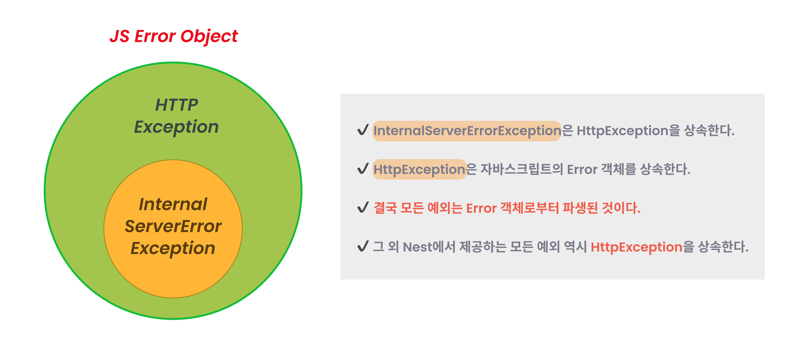
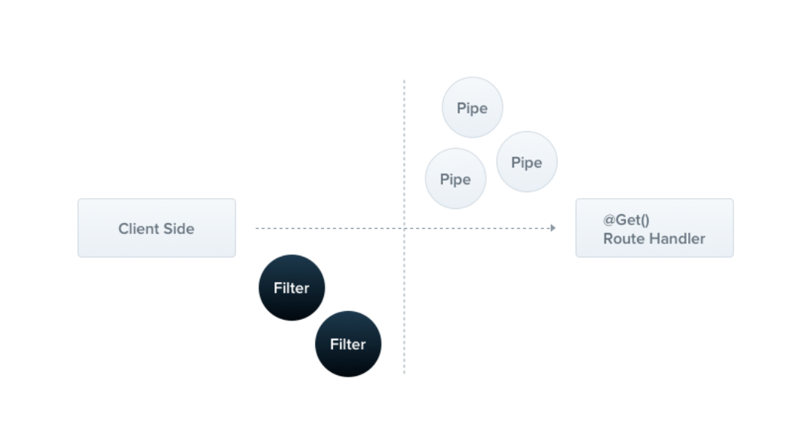

# [12장] 모든 것은 항상 실패한다: 예외 필터

> 모든 것은 항상 실패한다.

- 베르너 보겔스Werner Vogels, AWS CTO
  >

# 12.1 예외 처리

- Nest는 프레임워크 내에 애플리케이션을 통틀어 제대로 처리하지 못한 예외를 처리하는 역할을 하는 `예외 레이어`를 두고있다.
- 내장 예외 필터는 인식할 수 없는 에러를 `InternalServerErrorException`으로 변환한다.

<p align="center">
  
  </p>

# NestJS 표준 예외 클래스 정리

모든 예외는 다음과 같은 방식으로 사용할 수 있습니다:

- 기본 메시지: `throw new NotFoundException();`
- 커스텀 메시지: `throw new NotFoundException('사용자를 찾을 수 없습니다.');`
- 객체 형태: `throw new NotFoundException({ message: '사용자를 찾을 수 없습니다.', error: 'Not Found' });`

### ✅ NestJS 표준 예외 클래스 정리표

| 예외 클래스                     | HTTP 상태 코드 | 의미 설명                                           |
| ------------------------------- | -------------- | --------------------------------------------------- |
| `BadRequestException`           | 400            | 잘못된 요청 (유효성 검사 실패 등)                   |
| `UnauthorizedException`         | 401            | 인증되지 않음 (로그인 필요 등)                      |
| `PaymentRequiredException`      | 402            | 결제 필요 (사용은 드묾)                             |
| `ForbiddenException`            | 403            | 금지됨 (권한 부족)                                  |
| `NotFoundException`             | 404            | 리소스를 찾을 수 없음                               |
| `MethodNotAllowedException`     | 405            | 허용되지 않은 HTTP 메서드                           |
| `NotAcceptableException`        | 406            | 허용되지 않는 응답 포맷                             |
| `RequestTimeoutException`       | 408            | 요청 시간 초과                                      |
| `ConflictException`             | 409            | 충돌 발생 (중복 리소스 등)                          |
| `GoneException`                 | 410            | 리소스가 더 이상 사용 불가                          |
| `PayloadTooLargeException`      | 413            | 페이로드가 너무 큼                                  |
| `UnsupportedMediaTypeException` | 415            | 지원되지 않는 미디어 타입                           |
| `UnprocessableEntityException`  | 422            | 요청 구문은 맞지만 처리 불가 (ex. 유효성 검사 실패) |
| `TooManyRequestsException`      | 429            | 너무 많은 요청 (rate limiting)                      |
| `InternalServerErrorException`  | 500            | 서버 내부 오류                                      |
| `NotImplementedException`       | 501            | 아직 구현되지 않음                                  |
| `BadGatewayException`           | 502            | 게이트웨이 오류                                     |
| `ServiceUnavailableException`   | 503            | 서비스 불가 상태                                    |
| `GatewayTimeoutException`       | 504            | 게이트웨이 시간 초과                                |

# 12.2 예외 필터

<p align="center">
  
 <p align="center"><em> > 출처 : nestjs 공식 홈페이지</em></p>
  </p>

- Nest에서 제공하는 전역 예외 필터 외에 직접 `예외 필터(Exception filter)`레이어를 둬, 원하는 대로 예외를 다룰 수 있다.
- 예외가 일어났을 대 로그를 남기거나 응답 객체를 원하는 대로 변경하고자 하는 등의 요구 사항을 해결하고자 할 때 사용한다.

```tsx
// CustomHttpExceptionFilter.ts

import {
  ExceptionFilter,
  Catch,
  ArgumentsHost,
  HttpException,
  HttpStatus,
} from "@nestjs/common";
import { Request, Response } from "express";

@Catch() // 모든 예외를 캐치함 (필요 시 특정 예외만 지정 가능)
export class CustomHttpExceptionFilter implements ExceptionFilter {
  catch(exception: unknown, host: ArgumentsHost) {
    const ctx = host.switchToHttp();
    const response = ctx.getResponse<Response>();
    const request = ctx.getRequest<Request>();
    const status =
      exception instanceof HttpException
        ? exception.getStatus()
        : HttpStatus.INTERNAL_SERVER_ERROR;

    const message =
      exception instanceof HttpException
        ? exception.getResponse()
        : "Internal server error";

    response.status(status).json({
      success: false,
      timestamp: new Date().toISOString(),
      path: request.url,
      statusCode: status,
      message,
    });
  }
}
```

## 컨트롤러/핸들러에만 적용

```tsx
import { Controller, Get, UseFilters } from "@nestjs/common";
import { CustomHttpExceptionFilter } from "./filters/CustomHttpExceptionFilter";

@Controller("user")
@UseFilters(CustomHttpExceptionFilter) // 이 컨트롤러 전체에 적용
export class UserController {
  @Get()
  findAll() {
    throw new Error("예기치 못한 에러 발생!");
  }
}
```

## 특정 메서드에만 적용

```tsx
@UseFilters(new CustomHttpExceptionFilter())
@Get('profile')
getProfile() {
  throw new HttpException('사용자 없음', 404);
}
```

| 항목                         | 설명                                                         |
| ---------------------------- | ------------------------------------------------------------ |
| `@Catch()`                   | 필터가 어떤 예외를 처리할지 결정함. 생략 시 모든 예외를 처리 |
| `ExceptionFilter` 인터페이스 | `catch()` 메서드 구현 필수                                   |
| `host.switchToHttp()`        | HTTP 레이어로 접근하여 request/response 사용 가능            |
| `response.status().json()`   | 커스텀 에러 응답 포맷 구성 가능                              |
| `@UseFilters()`              | 특정 컨트롤러/핸들러에만 필터 적용 가능                      |
