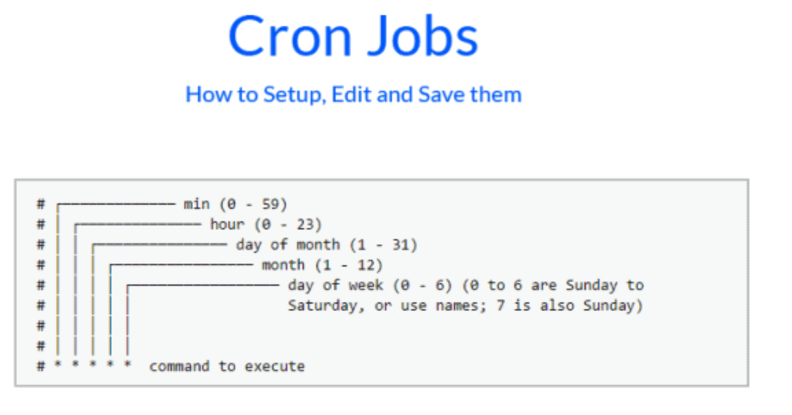

# 14장 태스크 스케줄링

## 14.1 @nestjs/schedule 패키지

- 서비스를 개발하다 보면 주기적으로 동일한 작업을 처리하는 경우가 생김
  - 유로 서비스 구독에 따른 정기 결제 등
- 이런 주기적 반복 작업을 task 또는 batch라고 부름.
- 태스크 스케줄링을 반드시 반복적인 작업에만 적용해야 하는 것은 아님. 예약 발송같은 1회성 태스크를 만들 수도 있음.

테스크 스케줄링은 `@nestjs/schedule` 패키지에 포함된 ScheduleModule을 사용함.

```
import { Module } from '@nestjs/common';
import { TaskService } from './task.service';
import { ScheduleModule } from '@nestjs/schedule';

@Module({
  imports: [ScheduleModule.forRoot()],
  providers: [TaskService],
})
export class BatchModule {}

```

ScheduleModule은 forRoot() 메서드를 통해 가져오는데, 이 과정에서 Nets는 스케줄러를 초기화 하고 앱에 선언한 크론 잡과 타임아웃, 인터벌을 등록함.

- 타임아웃: 스케줄링이 끝나는 시각
- 인터벌: 주기적으로 반복되는 시간 간격.

태스크 스케줄링은 모든 모듈이 예약된 작업을 로드하고 확인하는 onApplicationBootsteap 생명주기 훅이 발생할 때 등록됨.

## 14.2 태스크 스케줄링을 선언하는 3가지 방식

### 14.2.1 크론 잡 선언 방식

- 크론 잡 선언 방식은 @Cron 데커레이터를 선언한 메서드를 태스크로 구현하는 방식.

```
import { Injectable, Logger } from '@nestjs/common';
import { Cron } from '@nestjs/schedule';

@Injectable()
export class TaskService {
  private readonly logger = new Logger(TaskService.name);

  @Cron('* * * * * *', { name: 'cronTask' })
  handleCron() {
    this.logger.log('Task Called');
  }
}
```

@Cron의 첫 번째 인수는 태스크의 반복 주기로서 표준 크론 패턴을 따름. 공백으로 구분된 여섯 개의 값을 가지는 문자열을 입력받음.

<p align="center">
 </p>

첫 번째 자리는 초를 나타내는 자리인데 이를 생략하고 다섯 자리만 표기하면 초는 0으로 취급됨.

한 번만 수행되는 태스크를 등록하려면 수행되는 시각을 Date 객체로 직접 설명하면 됨.

e.g) 앱이 실행되고 나서 3초 뒤에 수행

```
@Cron(new Date(Date.now() + 3 * 1000))
```

Nest는 자주 사용할 만한 크론 패턴을 CronExpression 열거형으로 제공함.

e.g) 매주 월요일부터 금요일까지 새벽 1시에 수행되는 태스크

```
@Cron(CronExpression.MONDAY_TO_FRIDAY_AT_1AM)
```

@Cron 데커레이터의 두 번째 인수는 CronOptions 객체

````
export type CronOptions = {
    /**
     * Specify the name of your cron job. This will allow to inject your cron job reference through `@InjectCronRef`.
     */
    name?: string;
    /**
     * Specify the timezone for the execution. This will modify the actual time relative to your timezone. If the timezone is invalid, an error is thrown. You can check all timezones available at [Moment Timezone Website](http://momentjs.com/timezone/). Probably don't use both ```timeZone``` and ```utcOffset``` together or weird things may happen.
     */
    timeZone?: unknown;
    /**
     * This allows you to specify the offset of your timezone rather than using the ```timeZone``` param. Probably don't use both ```timeZone``` and ```utcOffset``` together or weird things may happen.
     */
    utcOffset?: unknown;
    /**
     * If you have code that keeps the event loop running and want to stop the node process when that finishes regardless of the state of your cronjob, you can do so making use of this parameter. This is off by default and cron will run as if it needs to control the event loop. For more information take a look at [timers#timers_timeout_unref](https://nodejs.org/api/timers.html#timers_timeout_unref) from the NodeJS docs.
     */
    unrefTimeout?: boolean;
    /**
     * If true, no additional instances of cronjob will run until the current onTick callback has completed.
     * Any new scheduled executions that occur while the current cronjob is running will be skipped entirely.
     */
    waitForCompletion?: boolean;
    /**
     * This flag indicates whether the job will be executed at all.
     * @default false
     */
    disabled?: boolean;
} & ({
    timeZone?: string;
    utcOffset?: never;
} | {
    timeZone?: never;
    utcOffset?: number;
});
````

### 14.2.2 인터벌 선언 방식

태스크 수행 함수에 @Interval 데커레이터를 사용할 수도 있음. 첫 번째 인수는 태스크이름, 두 번째 인수는 타임아웃 시간(밀리세턴드)

e.g) 앱이 실행된 후 3초 후에 처음 수행되고, 3초마다 반복.

```
@Interval('intervalTask', 3000)
handleInterval() {
  this.logger.log('Task Called by interval');
}
```

### 14.2.3 타임아웃 선언 방식

타임아웃 선언 방식은 앱이 실행된 후 태스크를 단 한 번만 수행. @Timeout 데커레이터를 사용하고, 인수는 인터벌과 동일.

```
@Timeout('timeoutTask', 5000)
handleTimeout('task Called by timeout') {
  this.logger.log(')
}
```

## 14.3 동적 태스크 스케줄링

앱의 구동 중 특정 조건을 만족했을 때 태스크를 등록해야 하는 경우가 있음. 동적 태스크 스케줄링은 ShedulerRegistry에서 제공하는 API를 사용함.

```
import { Injectable, Logger } from '@nestjs/common';
import { Cron, CronExpression, Interval, SchedulerRegistry, Timeout } from '@nestjs/schedule';
import { CronJob } from 'cron';

@Injectable()
export class TaskService {
  private readonly logger = new Logger(TaskService.name);

  constructor(private schedulerRegistry: SchedulerRegistry) { // 1. schedulerRegistry 객체를 TaskService에 주입
    this.addCronJob();
    // 2. TaskService가 생성될 때 크론 잡 하나를 schedulerRegistry에 추가.(추가만 해두고 스케줄링 등록은 나중에)
  }

  addCronJob() {
    const name = 'cronSample';

    const job = new CronJob(`* * * * * *`, () => {
      this.logger.warn(`run! ${name}`);
    });

    this.schedulerRegistry.addCronJob(name, job);

    this.logger.warn(`job ${name} added!`);
  }
}
```

등록된 크론 잡을 스케줄링으로 동작시키고 중지하는 컨트롤러.

```
import { Controller, Post } from '@nestjs/common';
import { SchedulerRegistry } from '@nestjs/schedule';

@Controller('batches')
export class BatchController {
  constructor(private scheduler: SchedulerRegistry) { }
  // 1. 컨트롤러에도 SchedulerRegistry를 주입 받음.

  @Post('/start-sample')
  start() {
    const job = this.scheduler.getCronJob('cronSample');
    // 2. 크론 잡을 가져옴

    job.start(); // 3. 크론 잡 실행
    console.log('start!! ', job.lastDate());

    console.log(job.nextDates(3))
  }

  @Post('/stop-sample')
  stop() {
    const job = this.scheduler.getCronJob('cronSample');

    job.stop();
    console.log('stopped!! ', job.lastDate());
  }
}
```
