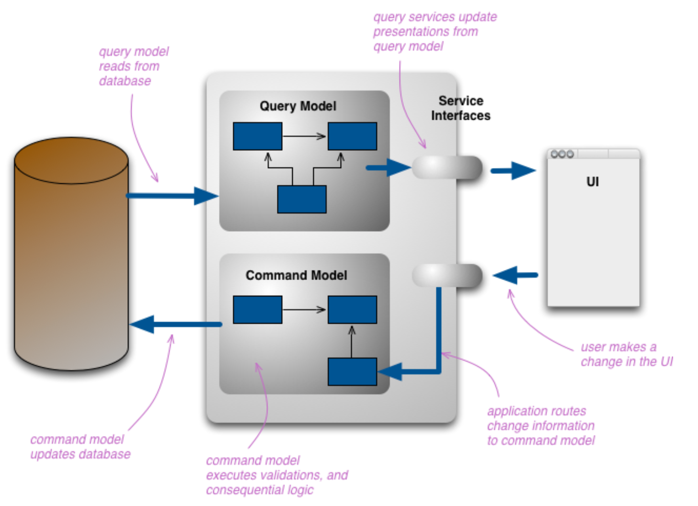

# [16장] CQRS를 이용한 관심사 분리

# 16.1 CQRS 패턴

- CQRS(Command Query Responsibility Separation) 패턴
- 시스템에서 읽기(조회) 와 쓰기(명령) 의 책임을 명확히 분리하는 아키텍처 패턴
- 대규모 시스템, 고성능 요구 사항이 있는 환경, 혹은 복잡한 비즈니스 로직을 가진 도메인에 적합.

## 🧩 핵심 개념

| 개념        | 설명                                                                                            |
| ----------- | ----------------------------------------------------------------------------------------------- |
| **Command** | 데이터를 변경하는 요청 (예: 생성, 수정, 삭제) → 부작용 있음, 결과 없음 (void 또는 ID 반환 정도) |
| **Query**   | 데이터를 조회하는 요청 (예: 목록, 상세 조회) → 부작용 없음, 결과만 반환                         |

<p align="center">
  
 <p align="center"><em> > 출처 : [마틴 파울러 블로그](https://martinfowler.com/bliki/CQRS.html)</em></p>
  </p> 


## 🛠️ CQRS를 사용하는 이유

### 장점

- **관심사의 분리 (Separation of Concerns):** 조회와 명령의 책임 분리
- **확장성 (Scalability):** 읽기와 쓰기를 독립적으로 확장 가능
- **성능 최적화:** 읽기에는 캐시, 읽기 전용 DB, 복잡한 Projection 등을 사용 가능
- **복잡한 도메인에 적합:** 도메인 주도 설계(DDD)와 궁합이 좋음

### 단점

- **복잡성 증가:** 읽기/쓰기 모델을 따로 유지해야 하므로 구현이 복잡
- **일관성 문제:** 최종 일관성(Eventual Consistency) 구조를 고려해야 함

## 🧱 기본 구조 (NestJS 예시 기반)

```
src/
  └── application/
        ├── commands/
        │     └── create-user.command.ts
        │     └── handlers/create-user.handler.ts
        └── queries/
              └── get-user.query.ts
              └── handlers/get-user.handler.ts
```

### ✅ 명령 (Command)

```tsx
// create-user.command.ts
export class CreateUserCommand {
  constructor(
    public readonly email: string,
    public readonly password: string
  ) {}
}
```

```tsx
// create-user.handler.ts
@CommandHandler(CreateUserCommand)
export class CreateUserHandler implements ICommandHandler<CreateUserCommand> {
  constructor(private readonly userRepository: UserRepository) {}

  async execute(command: CreateUserCommand): Promise<void> {
    const user = new User(command.email, command.password);
    await this.userRepository.save(user);
  }
}
```

### ✅ 조회 (Query)

```tsx
// get-user.query.ts
export class GetUserQuery {
  constructor(public readonly userId: string) {}
}
```

```tsx
// get-user.handler.ts
@QueryHandler(GetUserQuery)
export class GetUserHandler implements IQueryHandler<GetUserQuery> {
  constructor(private readonly userReadRepository: UserReadRepository) {}

  async execute(query: GetUserQuery): Promise<UserDto> {
    return await this.userReadRepository.findById(query.userId);
  }
}
```

# CQRS with @nestjs/cqrs

```bash
$ npm i @nestjs/cqrs
```

## ✅ 언제 CQRS를 써야 할까?

**적합한 경우:**

- 읽기/쓰기 비율이 극단적으로 차이남
- 복잡한 쓰기 로직과 단순한 읽기 로직이 공존함
- 멀티 DB, 멀티 팀, 멀티 서비스 환경
- 확장성과 유지보수가 중요함

**부적합한 경우:**

- 단순한 CRUD 애플리케이션
- 빠른 MVP 개발이 목적일 때
