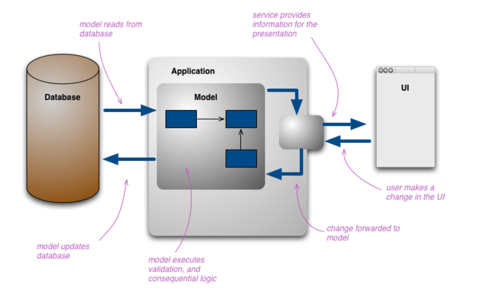

# 16장 CQRS를 이용한 관심사 분리

## 16.1 CQRS패턴

CQRS패턴은 명령과 조회를 분리하여 성능과 확장성 및 보안성을 높일 수 있도록 해주는 아키텍처 패턴.

Command Query Responsibility Separation

조회 시의 모델과 데이터를 업데이트할 때 모델을 다르게 가져가도록 하는 방식.

<p>

</p>

CQRS의 이점이 있는 경우
**CQRS를 사용하면 몇 가지 복잡한 도메인을 다루기 더 쉬운 경우**:

- CQRS를 사용하면 복잡성이 추가되기 때문에 생산성이 감소.
- 시스템 전체가 아닌 도메인 주도 설계에서 말하는 bounded context 내에서만 사용해야 함

**고성능 처리가 필요한 애플리케이션을 다루는 경우**:

- CQRS를 사용하면 읽기 및 쓰기 작업에서 로드를 분리하여 각각을 독립적으로 확장할 수 있음.
- 성능을 위해 쓰기는 RDB로, 읽기는 도큐먼트 DB를 사용하는 경우도 많음.
- 애플리케이션에서 읽기와 쓰기 사이에 큰 성능 차이가 있는 경우 CQRS를 쓰면 편리함.

CQRS를 사용하면 자연스럽게 다른 아키텍처 패턴과 잘 어울리게 됨.

- CRUD를 통해 상호작용하는 단일 표현에서 작업 기반 UI로 쉽게 이동
- 예를들어 ReservationStatus를 RESERVED로 설정이라는 명령을 룸 예약으로 변경함.
- 이벤트 기반 프로그래밍 모델과 잘 맞음. 이를 통해 이벤트 소싱을 쉽게 활용 가능
- 복잡한 도메인을 다루고 DDD를 적용하는데 적합.

# 16.2 유저 서비스에 CQRS 적용

서비스가 커질수록 변경 영향도는 점차 커지고 컨트롤러와 서비스, 영성화 및 도메인 레이어에서 주고받는 데이터가 복잡해짐. 콘텍스트가 상이한 곳에서 모델을 그대로 전달하고 사용하는 경우가 발생.

`npm i @nestjs/cqrs`

### 16.2.1 커맨드

CRUD는 커맨드를 이용하여 처리. 커맨드는 서비스 계층이나 컨트롤러, 게이트웨이에서 직접 발송할 수 있음. 전송한 커맨드는 커맨드 핸들러가 받아서 처리.

e.g) 유저 생성로직 커맨트로 처리

```
import { ICommand } from '@nestjs/cqrs';

export class CreateUserCommand implements ICommand {
  constructor(
    readonly name: string,
    readonly email: string,
    readonly password: string,
  ) { }
}
```

컨트롤러에서 유저 생성 요청이 왔을 때 직접 UserService의 함수를 호출하지 말고 커맨드를 전달

```
import { Body, Controller, Get, Param, Post, Query, UseGuards, Inject, LoggerService, InternalServerErrorException, Logger } from '@nestjs/common';
import { AuthGuard } from 'src/auth.guard';
import { CreateUserDto } from './dto/create-user.dto';
import { UserLoginDto } from './dto/user-login.dto';
import { VerifyEmailDto } from './dto/verify-email.dto';
import { UserInfo } from './UserInfo';
import { CommandBus, QueryBus } from '@nestjs/cqrs';
import { CreateUserCommand } from './command/create-user.command';
import { VerifyEmailCommand } from './command/verify-email.command';
import { LoginCommand } from './command/login.command';
import { GetUserInfoQuery } from './query/get-user-info.query';

@Controller('users')
export class UsersController {
  constructor(
    // 1. @nest/cqrd 패키지에서 제공하는 CommandBus 주입
    private commandBus: CommandBus,
    private queryBus: QueryBus,
    @Inject(Logger) private readonly logger: LoggerService,
  ) { }

  @Post()
  async createUser(@Body() dto: CreateUserDto): Promise<void> {
    const { name, email, password } = dto;

// 2. CreateUserCommand 전송
    const command = new CreateUserCommand(name, email, password);

    return this.commandBus.execute(command);
  }

  @Post('/email-verify')
  async verifyEmail(@Query() dto: VerifyEmailDto): Promise<string> {
    const { signupVerifyToken } = dto;

    const command = new VerifyEmailCommand(signupVerifyToken);

    return this.commandBus.execute(command);
  }

  @Post('/login')
  async login(@Body() dto: UserLoginDto): Promise<string> {
    const { email, password } = dto;

    const command = new LoginCommand(email, password);

    return this.commandBus.execute(command);
  }

  @UseGuards(AuthGuard)
  @Get(':id')
  async getUserInfo(@Param('id') userId: string): Promise<UserInfo> {
    const getUserInfoQuery = new GetUserInfoQuery(userId);

    return this.queryBus.execute(getUserInfoQuery);
  }
}
```

UserController는 더 이상 UserService에 의존하지 않음.
CreateUserHandler를 통해 유저 생성 로직을 처리함.

```
import * as uuid from 'uuid';
import { ulid } from 'ulid';
import { Injectable, UnprocessableEntityException } from '@nestjs/common';
import { CommandHandler, EventBus, ICommandHandler } from '@nestjs/cqrs';
import { InjectRepository } from '@nestjs/typeorm';
import { DataSource, Repository } from 'typeorm';
import { UserEntity } from '../entity/user.entity';
import { CreateUserCommand } from './create-user.command';
import { UserCreatedEvent } from '../event/user-created.event';
import { TestEvent } from '../event/test.event';

@Injectable()
@CommandHandler(CreateUserCommand)
export class CreateUserHandler implements ICommandHandler<CreateUserCommand> {
  constructor(
    private dataSource: DataSource,
    private eventBus: EventBus,

    @InjectRepository(UserEntity) private usersRepository: Repository<UserEntity>,
  ) { }

  async execute(command: CreateUserCommand) {
    const { name, email, password } = command;

    const userExist = await this.checkUserExists(email);
    if (userExist) {
      throw new UnprocessableEntityException('해당 이메일로는 가입할 수 없습니다.');
    }

    const signupVerifyToken = uuid.v1();

    await this.saveUserUsingTransaction(name, email, password, signupVerifyToken);

    this.eventBus.publish(new UserCreatedEvent(email, signupVerifyToken));
    this.eventBus.publish(new TestEvent());
  }

  private async checkUserExists(emailAddress: string): Promise<boolean> {
    const user = await this.usersRepository.findOne({
      where: { email: emailAddress }
    });

    return user !== null;
  }

  private async saveUserUsingTransaction(name: string, email: string, password: string, signupVerifyToken: string) {
    await this.dataSource.transaction(async manager => {
      const user = new UserEntity();
      user.id = ulid();
      user.name = name;
      user.email = email;
      user.password = password;
      user.signupVerifyToken = signupVerifyToken;

      await manager.save(user);
    })
  }
}
```

### 16.2.2 이벤트

회원가입을 처리하는 과정에 이메일을 전송하는 로직이 포함.
현재 회원가입 처리와 이메일 발송은 강하게 결합되어 있음.
이럴 경우 회원 가입 이벤트를 발송하고 이벤트를 구독하는 다른 모듈에서 이벤트를 처리하도록 하는 것이 좋음.

### 16.2.3 쿼리

유저 정보 조회 부분도 쿼리로 분리 가능. 커맨드와 유사한 방법으로 구현할 수 있음.

```
import { NotFoundException } from '@nestjs/common';
import { IQueryHandler, QueryHandler } from '@nestjs/cqrs';
import { InjectRepository } from '@nestjs/typeorm';
import { Repository } from 'typeorm';
import { UserEntity } from '../entity/user.entity';
import { UserInfo } from '../UserInfo';
import { GetUserInfoQuery } from './get-user-info.query';

@QueryHandler(GetUserInfoQuery)
export class GetUserInfoQueryHandler implements IQueryHandler<GetUserInfoQuery> {
  constructor(
    @InjectRepository(UserEntity) private usersRepository: Repository<UserEntity>,
  ) { }

  async execute(query: GetUserInfoQuery): Promise<UserInfo> {
    const { userId } = query;

    const user = await this.usersRepository.findOne({
      where: { id: userId }
    });

    if (!user) {
      throw new NotFoundException('유저가 존재하지 않습니다');
    }

    return {
      id: user.id,
      name: user.name,
      email: user.email,
    };
  }
}
```

이제 GetUserInfoQuery를 쿼리 버스에 실어 보내면 됨.

```
import { Body, Controller, Get, Param, Post, Query, UseGuards, Inject, LoggerService, InternalServerErrorException, Logger } from '@nestjs/common';
import { AuthGuard } from 'src/auth.guard';
import { CreateUserDto } from './dto/create-user.dto';
import { UserLoginDto } from './dto/user-login.dto';
import { VerifyEmailDto } from './dto/verify-email.dto';
import { UserInfo } from './UserInfo';
import { CommandBus, QueryBus } from '@nestjs/cqrs';
import { CreateUserCommand } from './command/create-user.command';
import { VerifyEmailCommand } from './command/verify-email.command';
import { LoginCommand } from './command/login.command';
import { GetUserInfoQuery } from './query/get-user-info.query';

@Controller('users')
export class UsersController {
  constructor(
    private commandBus: CommandBus,
    private queryBus: QueryBus,
    @Inject(Logger) private readonly logger: LoggerService,
  ) { }

  @UseGuards(AuthGuard)
  @Get(':id')
  async getUserInfo(@Param('id') userId: string): Promise<UserInfo> {
    const getUserInfoQuery = new GetUserInfoQuery(userId);

    return this.queryBus.execute(getUserInfoQuery);
  }
}
```
